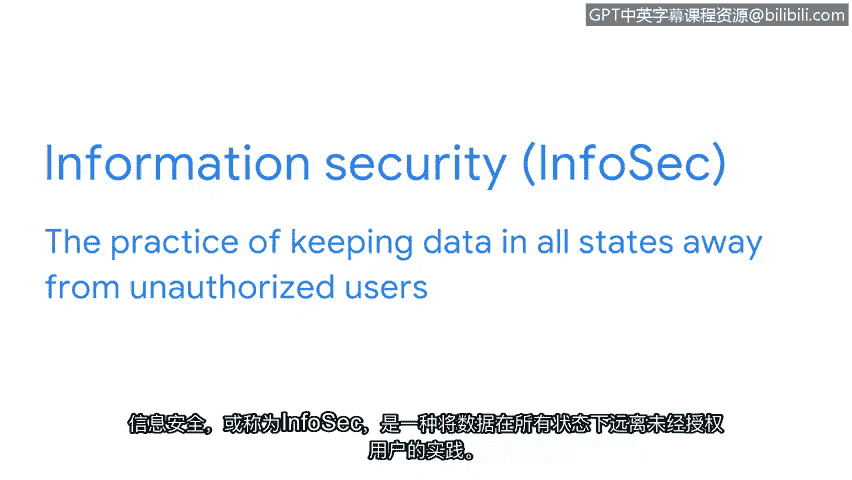

# 007：数字世界中的资产

在本节课中，我们将要学习数字世界中的核心资产——数据，并了解数据在不同状态下的安全含义。理解这些概念是制定有效资产管理计划的基础。

## 概述

我们已经探讨了组织资产是什么以及为何需要保护。您也初步了解了安全团队需要保护的资产数量之庞大。之前，我们开始研究安全资产管理及其对组织的重要性。安全团队根据价值对资产进行分类。接下来，让我们扩展安全思维，思考这个问题：一项资产的价值究竟体现在哪里？在当今时代，答案通常是信息。

## 数据的定义与挑战

大多数信息以数字形式存在，我们称之为**数据**。数据是由计算机翻译、处理或存储的信息。我们生活在一个互联的世界，全球数十亿设备连接到互联网，并时刻在交换数据。事实上，此刻就有数百万条数据正在传递到您的设备。

与物理资产相比，数字资产面临额外的挑战。您需要理解的是，保护数据取决于数据所在的位置及其正在进行的活动。

## 数据的三种状态

安全团队在三种不同的状态下保护数据：使用中、传输中和静止时。让我们更详细地研究这个概念。

以下是数据的三种状态：

*   **数据在使用中**：指正被一个或多个用户访问的数据。
    *   **示例**：想象您带着笔记本电脑在公园。天气晴朗，您坐在长椅上查看电子邮件。一旦您登录，您的收件箱就被视为处于“使用中”状态。
*   **数据在传输中**：指从一个点传输到另一个点的数据。
    *   **示例**：当您登录账户时，收到朋友发来的一条消息，内容是关于安全行业发展的有趣文章。您决定回复感谢。当您点击“发送”时，这封回信就成为了“传输中”数据的例子。
*   **数据在静止时**：指当前未被访问的数据。
    *   **示例**：在这种状态下，数据通常存储在物理设备上。当您查看完电子邮件并合上笔记本电脑，然后决定收拾东西去附近的咖啡馆吃早餐时，您笔记本电脑中的数据就处于“静止”状态。

## 连接回资产管理

既然我们理解了数据的这些状态，让我们将其与资产管理联系起来。之前我提到，信息是公司可以拥有的最有价值的资产之一。

**信息安全**是保护所有状态下的数据免受未授权用户访问的实践。信息安全薄弱是一个严重问题，可能导致身份盗窃、财务损失和声誉损害等后果。这些事件有可能损害组织、其合作伙伴及其客户。

## 不断发展的数字世界

在您作为安全分析师的工作中，还有更多需要考虑的因素。随着我们的数字世界不断变化，我们对“静止数据”的理解也在适应。像智能手机这样的物理设备更普遍地将数据存储在云端，这意味着我们的信息并不一定因为手机放在桌上就处于“静止”状态。随着我们的世界日益互联，我们应该始终警惕新的漏洞。

请记住，保护数据取决于数据的位置及其活动。跟踪信息是公司在考虑其安全计划时需要解决的难题的一部分。理解数据的三种状态使安全团队能够分析风险，并为不同情况确定资产管理计划。

## 总结

本节课中，我们一起学习了数字资产的核心——数据。我们明确了数据的定义，并重点探讨了数据在**使用中**、**传输中**和**静止时**这三种不同状态下的安全含义。理解这些状态是进行风险分析和制定针对性资产管理策略的关键。随着技术发展，我们对数据状态的理解也需不断更新，以应对日益复杂的网络安全环境。