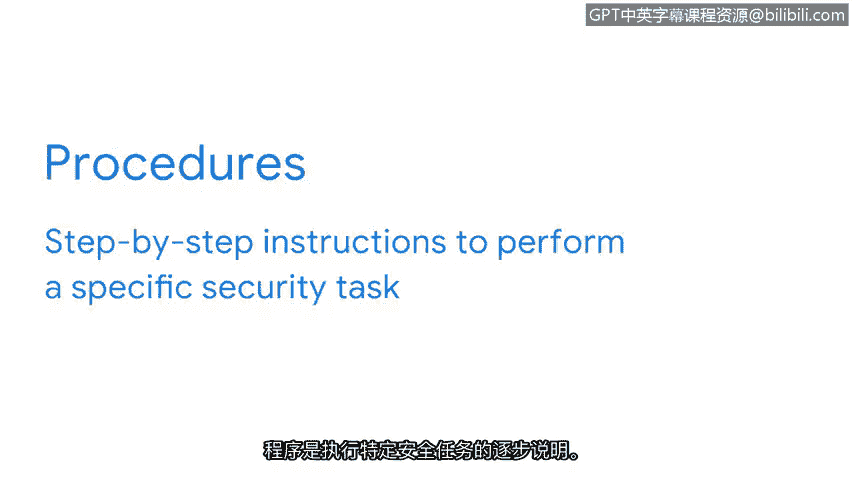

**谷歌网络安全专业证书：第五课：资产、威胁和漏洞**


**P8：安全计划的要素**


在本节课中，我们将要学习安全计划的核心构成要素。我们将了解安全不仅仅是技术问题，更是涉及人员、流程和文化的综合体系。通过学习安全计划的三个基本组成部分，你将理解组织如何系统地管理风险并保护其资产。

安全关乎人员、流程和技术。这是一项团队协作。

保护资产远不止一个人或一个IT部门的职责。

事实上，安全是一种文化。它是一套贯穿组织各个层级的共同价值观。这些价值观涉及从员工到供应商再到客户的每一个人。

保护数字和物理资产需要每个人的参与，这可能是一个挑战。这正是安全计划存在的意义。计划形式多样，但都有一个共同目标：为风险发生做好准备。

将重点放在人员身上，才能制定出最有效的安全计划。考虑到所有相关人员的不同背景和观点，确保在出现问题时没有人被遗漏。

我们之前讨论过，风险是任何可能影响资产**机密性、完整性或可用性**的事物。大多数安全计划通过按类别和因素分解风险来应对它们。

一些常见的风险类别可能包括信息的**损坏、泄露或丢失**。这些情况可能由多种因素导致。

以下是可能导致风险的常见因素：
*   **物理损坏或设备故障**。
*   **攻击**。
*   **人为错误**。

例如，一位新入职的学校教师可能会被要求在第一天上课前签署一份合同。该协议可能会警告一些与人为错误相关的常见风险，例如使用个人电子邮件发送敏感信息。安全计划可能要求所有新员工签署此协议，从而有效地传播确保所有人目标一致的价值观。

这只是安全计划可能涉及的风险类型和原因的一个例子。这些内容因公司而异，但这些计划的传达方式在各行业中却是相似的。

安全计划由三个基本要素组成：**策略、标准和规程**。这三个要素是公司分享其安全计划的方式。在安全领域之外，这些词常常被混用，但很快你会发现，在此语境下，它们各自具有非常具体的含义和功能。

**策略**是减少风险和保护信息的一套规则。策略是每个安全计划的基础。它们通过回答诸如“我们要保护什么以及为什么”等问题，为组织内外的人员提供指导。策略侧重于战略层面，明确安全计划的**范围、目标和限制**。

例如，许多公司要求新入职员工签署**可接受使用策略**。这些条款概述了员工访问公司系统的安全方式。

**标准**是计划的下一部分。它们具有战术功能，关注我们保护资产的程度。在安全领域，标准是指导如何制定策略的参考依据。理解标准的一个好方法是，它们**创建了一个参考点**。

例如，许多公司使用**NIST特别出版物800-63B**中确定的密码管理标准来改进其安全策略，具体规定员工的密码长度必须至少为8个字符。

**代码示例：一个简单的密码策略检查**
```python
def check_password_policy(password):
    # 检查密码长度至少为8个字符
    if len(password) >= 8:
        return True
    else:
        return False
```

计划的最后一部分是**规程**。规程是执行特定安全任务的**分步说明**。




组织通常会保留在整个公司范围内使用的多个规程文档。

以下是规程文档的示例：
*   员工如何选择安全密码。
*   如果密码被锁定，员工如何安全地重置密码。

与每个人分享清晰且可操作的规程，能在整个组织内建立**问责制、一致性和效率**。

😊 策略、标准和规程因公司而异，因为它们是根据每个组织的目标量身定制的。仅仅理解安全计划的结构就是一个很好的开始。

本节课中，我们一起学习了安全计划的三个核心要素：策略、标准和规程。希望你现在对它们是什么以及它们如何对实现安全团队协作至关重要有了更清晰的认识。理解这些基础概念，是你在网络安全领域构建专业知识的第一步。


