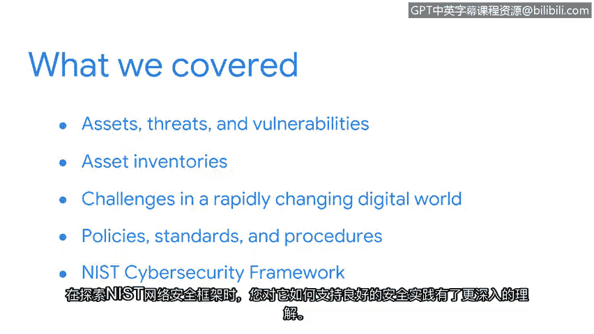

# 010：总结

在本节课中，我们共同学习了网络安全风险管理的基础知识，包括资产、威胁和漏洞的核心概念。现在，让我们回顾并总结这一周所学到的关键内容。

## 课程回顾

我们首先探讨了组织风险管理的基础构件：**资产**、**威胁**和**漏洞**。理解这三者之间的关系是评估和管理风险的第一步。其核心关系可以概括为：**风险 = 威胁 × 漏洞 × 资产价值**。

随后，我们强调了资产清单的重要性。保护公司资产的前提是了解它们的位置和责任人。一个完整的资产清单是有效安全管理的基石。

接着，我们审视了快速变化的数字世界所带来的挑战。在这个环境中，保护数据需要理解其三种状态：**使用中**、**传输中**和**静态存储**。针对不同状态的数据，需要采取不同的保护策略。

最后，我们宏观地探讨了**策略**、**标准**和**规程**。这三者共同构成了实现安全目标的框架。策略是高层指导，标准是具体规范，而规程则是可操作的步骤。

## 持续学习的重要性

网络安全领域没有放之四海而皆准的解决方案。在学习NIST网络安全框架时，我们认识到它如何为良好的安全实践提供支持。该框架的核心功能包括：**识别**、**保护**、**检测**、**响应**和**恢复**。

与此同时，攻击者也在不断提升技能，寻找新的方法来突破防御。安全格局始终在变化。因此，作为一名安全从业者，持续学习、紧跟最佳实践和新兴趋势是工作的重要组成部分。

## 展望下一阶段

做得很好，你已经完成了本部分的学习。成为一名安全从业者需要奉献精神和求知欲。

回顾我自己的安全领域之旅，我为你们持续的投入感到自豪。接下来，我们将扩展我们的安全思维，学习安全团队用于保护组织资产的不同系统和工具。我对此充满期待。

---

**本节课总结**：本节课中，我们一起学习了网络安全风险管理的基础，包括资产、威胁、漏洞的概念，数据保护的不同状态，以及策略、标准和规程的作用。我们认识到建立资产清单和遵循NIST等框架的重要性，并强调了在持续变化的威胁环境中保持学习和适应能力的必要性。