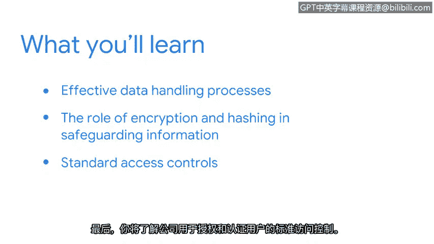

**谷歌网络安全专业证书第五课：《资产、威胁和漏洞》：P11：第二周课程导览**

在本节课中，我们将回顾第一周的学习内容，并预览第二周的核心主题。我们将聚焦于主动保护资产的安全控制措施，包括数据隐私、加密、哈希以及访问控制。

---

我对2017年发生的一起全球性网络安全事件深感着迷。我开始观看视频并准备参加认证考试，就像你们现在一样。起初我感到不知所措，但我的好奇心和热情驱使我继续在这个领域学习。我时常提醒自己，没有人天生就知晓一切，每个人都在学习的旅程中。即便现在，我依然记得初入这个行业时的感受。所以请相信我，当我说你们正在取得巨大进步时，我是认真的。我为你们的努力感到骄傲。

在展望我们即将深入探索的安全世界之前，让我们先花点时间回顾一下我们已经走过的路。

上一节中，我们主要聚焦于资产、风险和安全的概念。我们探讨了管理资产并确保其安全的重要性，讨论了数字世界为安全领域带来的新挑战与机遇。我们还花了一些时间探索安全计划。有了这些坚实的基础，我们已经准备好继续扩展我们的安全思维。

在本节中，我们将介绍用于主动保护资产的安全控制措施。我特意使用了“主动”这个词。正如你们即将发现的，这些控制措施是我们预先设置的保护机制，旨在问题发生之前就将其阻止。

我们将首先深入探讨隐私。在这里，你们将学习确保信息安全的有效数据处理流程。接下来，你们将探索加密和哈希在保护信息方面的作用。最后，你们将了解公司用于授权和验证用户身份的标准访问控制机制。

好了，你们准备好继续前进了吗？我已经准备好了。