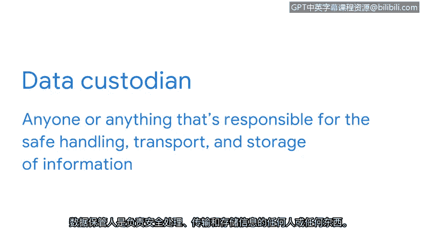

# 012：安全控制

在本节课中，我们将要学习**安全控制**的概念、类型及其在保护信息和维护隐私方面的重要作用。我们将了解技术、操作和管理三类控制，并探讨数据所有者与数据保管者之间的区别。

如今，信息无处不在。因此，组织面临着巨大压力，需要实施有效的**安全控制**，以保护每个人的信息免遭窃取或泄露。

**安全控制**是为降低特定安全风险而设计的防护措施。它们包含一系列广泛的工具，用于在事件发生前、发生时和发生后保护资产。安全控制可分为三种类型：**技术控制**、**操作控制**和**管理控制**。

上一节我们介绍了安全控制的定义，本节中我们来看看它的具体类型。

以下是三种主要的安全控制类型：

*   **技术控制**：这类控制包括用于保护资产的多种技术。例如**加密**、**身份验证系统**等。
*   **操作控制**：这类控制涉及日常安全环境的维护。通常由人员执行，例如**安全意识培训**和**事件响应**。
*   **管理控制**：这类控制侧重于前两类控制如何降低风险。管理控制的例子包括**策略**、**标准**和**程序**。通常，组织的安全策略会概述实现其目标所需的控制措施。

信息隐私在这些决策中扮演着关键角色。

**信息隐私**是指防止对数据的未授权访问和分发。信息隐私关乎选择权。个人和组织都应有权决定何时、如何以及在何种程度上共享其私人信息。

安全控制是用于规范信息隐私的技术。例如，假设您使用一个旅行应用程序预订航班。您可能会浏览航班列表，找到一个价格合适的航班来预订座位。为了支付，您需要输入一些个人信息，如姓名、电子邮件和信用卡号。

交易成功后，您就预订了航班。现在，您有理由期望航空公司在您注册时访问您输入的信息以完成预订。

然而，公司里的每个人都应该有权访问您的信息吗？营销部门的员工不需要访问您的信用卡信息。与客服人员共享该信息是合理的，但他们应该只在协助您处理预订时需要访问它。

为了维护隐私，安全控制旨在根据用户和具体情况限制访问权限。这被称为**最小权限原则**。设计安全控制时应牢记最小权限原则。当遵循此原则时，它们依赖于区分**数据所有者**和**数据保管者**。

*   **数据所有者**：是决定谁可以访问、添加、使用或销毁其信息的人。这个概念非常直接，除非存在多个所有者的情况。例如，一个组织的知识产权可以有多个数据所有者。
*   **数据保管者**：是负责信息的安全处理、传输和存储的任何个人或事物。

您是否注意到我提到了“事物”？这是因为除了人之外，组织及其系统也是人们信息的保管者。

在实施安全控制时，除了上述内容，还有其他考虑因素。请记住，数据是一种资产，就像任何其他资产一样，信息隐私需要适当的分类和处理。

随着本节的深入，我们将继续探索其他使之成为可能的安全控制。

本节课中我们一起学习了安全控制的核心概念、三种主要类型（技术、操作、管理），以及它们在维护信息隐私中的作用。我们还了解了最小权限原则，并区分了数据所有者与数据保管者的不同职责。理解这些是构建有效安全防护体系的基础。