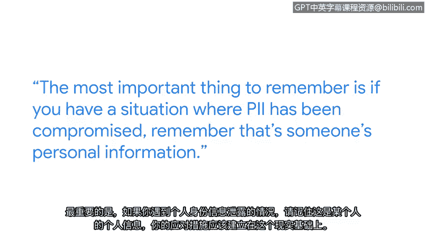

# 013：保护个人可识别信息的重要性

## 概述
在本节课中，我们将学习个人可识别信息的重要性及其保护措施。PII无处不在，是我们日常在线活动的基础组成部分。了解如何区分和处理不同敏感度的PII，并实施有效的保护策略，对于维护个人隐私和建立信任至关重要。

## 个人可识别信息的普遍性与分类
PII无处不在，是我们所有人持续在线工作的基本组成部分。如果你正在使用在线资源，你可能正在某个地方提供你的PII。

你的PII中，有些是许多人知道的，例如你的姓名。然后，还有一些你不希望很多人知道的敏感数据，例如你的银行账号或私人医疗健康信息。因此，我们做出这些区分，通常是因为这类信息需要以不同的方式处理。

## 在线时代保护PII的必要性
我们现在所做的一切，从上学、投票到车辆注册，都发生在线上。正因如此，确保我们的所有系统默认内置安全性变得极其重要。

## 保护个人可识别信息的实用建议
以下是保护PII的一些核心建议。

*   **静态数据加密**：在数据静态存储时，应尽可能对其进行加密。
*   **传输中数据加密**：当数据在互联网上传输时，应始终使用TLS或SSL进行加密。
*   **严格限制数据访问权限**：在公司内部，应非常清晰地考虑谁有权访问该数据。如果是非常敏感的数据，访问权限应仅限于极少数人。
*   **记录和审计访问行为**：在极少数需要访问该数据的情况下，应记录该次访问行为，包括访问者身份及访问理由。并且，应建立程序来审查这些数据的审计记录。

## 事件响应与建立信任
最重要的一点是，如果遇到PII泄露的情况，请记住那是某人的个人信息。你的响应应基于这一现实。

用户需要能够信任基础设施、系统、网站和设备。他们需要能够信任自己正在获得的体验。对我而言，这就是使命：帮助每天保护数十亿人的在线安全。

## 总结
本节课中，我们一起学习了个人可识别信息的定义、分类及其在数字时代的重要性。我们探讨了保护PII的关键措施，包括对静态和传输中数据的加密、严格的访问控制以及完善的审计记录。最后，我们强调了在安全事件中以人为本的响应态度，以及建立和维护用户信任的核心目标。