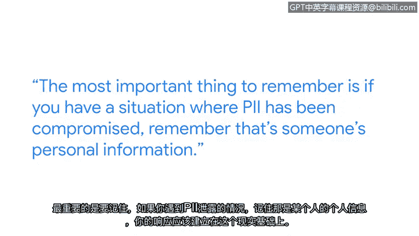

# 014：保护个人可识别信息的重要性

## 概述
在本节课中，我们将学习个人可识别信息的重要性及其保护措施。我们将了解PII的普遍性、不同类型数据的敏感性差异，以及保护这些信息的关键策略。

## 课程内容

大家好，我是Heather，现任谷歌安全工程副总裁。

PII无处不在。它是我们所有人持续在线工作的基本组成部分。

如果你正在使用在线资源，你可能正在某个地方提供你的PII。

你的部分PII是许多人知道的，例如你的姓名。

此外，还存在你不希望很多人知道的敏感数据，例如你的银行账户号码或私人医疗健康信息。

因此，我们做出这些区分。通常是因为这类信息需要以不同的方式处理。

我们现在所做的一切，从上学、投票到车辆注册，都发生在线上。正因如此，确保我们的所有系统默认内置安全性至关重要。

以下是保护PII的一些建议。

首先，当数据处于静态存储时，应尽可能对其进行加密。

其次，当数据在互联网上传输时，我们始终希望使用**TLS**或**SSL**对其进行加密。

第三，在公司内部，应非常清晰地考虑谁有权访问该数据。如果数据非常敏感，访问权限应仅限于极少数人。

在极少数情况下，如果有人确实需要访问该数据，则应记录该次访问。记录内容包括访问者身份以及访问理由。

此外，应建立一个程序来审查该数据的审计记录。

最重要的一点是，如果遇到PII泄露的情况，请记住那是某人的个人信息。你的应对措施应基于这一现实。

用户需要能够信任基础设施、系统、网站和设备。他们需要能够信任自己正在获得的体验。对我而言，这就是使命：帮助每天保护数十亿人的在线安全。

## 总结
本节课我们一起学习了个人可识别信息的重要性。我们认识到PII的普遍性及其敏感性差异，并掌握了保护PII的核心策略，包括静态与传输加密、严格的访问控制以及建立审计机制。最后，我们强调了在应对PII泄露事件时，应始终以保护用户个人信息和信任为核心。