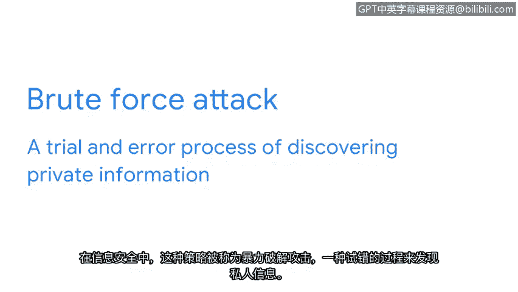

# 015：加密基础知识 🔐


在本节课中，我们将要学习加密技术的基本概念。加密是保护在线信息隐私的核心安全控制措施之一。我们将了解什么是加密、它如何工作，以及一个古老而简单的加密方法——凯撒密码。

## 互联网与隐私信息

互联网是一个开放的公网系统，有大量数据在其中流动。尽管我们都在线发送和存储信息，但有些信息我们选择在安全层面保持私密。这类数据被称为个人可识别信息。

个人可识别信息，简称PII，是指任何可用于推断个人身份的信息。这可以包括某人的姓名、医疗和财务信息、照片、电子邮件或指纹。在线维护PII的隐私很困难，需要正确的安全控制措施才能实现。

## 什么是加密？

用于保护在线信息的主要安全控制措施之一是密码学。**密码学**是将信息转换为非目标读者无法理解的形式的过程。

任何类型的数据都通过一个两步过程来保密：**加密**以隐藏信息，**解密**以恢复信息。

想象一下给朋友发送电子邮件的过程。该过程从获取原始且可读形式的数据开始，这种形式称为**明文**。加密接收该信息并将其打乱成不可读的形式，称为**密文**。然后我们使用解密将密文恢复为明文形式，使其再次可读。

隐藏和恢复私人信息的做法由来已久，远在计算机出现之前。

## 凯撒密码简介

上一节我们介绍了加密的基本概念，本节中我们来看看一个早期的加密方法。最早的密码学方法之一被称为**凯撒密码**。这个方法以罗马将军尤利乌斯·凯撒的名字命名，他在公元前1世纪末统治罗马帝国。他用它来保持他与他的军事将领之间的信息私密。

凯撒密码是一种相当简单的算法，其工作原理是将罗马字母表中的字母向前移动固定的位数。

> **算法**是一组解决问题的规则。具体在密码学中，**密码**是一种加密信息的算法。

例如，使用移位数为3的凯撒密码编码的消息会将A编码为D，B编码为E，C编码为F，依此类推。

在这个例子中，你可以给朋友发送一条消息“HELLO”，使用移位数为3，那么它会显示为“KHOOR”。

## 密钥的作用

现在，你可能想知道，如何知道凯撒密码加密的消息使用了多少位移位。答案是：你需要**密钥**。**加密密钥**是一种解密密文的机制。

在我们的例子中，密钥会告诉你我的消息是通过移位3加密的。有了这个信息，你就可以解锁隐藏的消息。**每一种加密形式都依赖于密码和密钥来确保信息转换的安全。**

以下是加密和解密过程的简单表示：
```
明文 --[加密算法 + 密钥]--> 密文
密文 --[解密算法 + 密钥]--> 明文
```

## 凯撒密码的缺陷

凯撒密码如今并未广泛使用，因为它有几个主要缺陷。一个缺陷与密码本身有关，另一个则与密钥有关。

这个特定的密码完全依赖于罗马字母表的字符来隐藏信息。例如，考虑一条使用英语字母表（只有26个字符）编写的消息。即使没有密钥，通过尝试26种不同的字母移位方式，破解用凯撒密码保护的消息也相当简单。



在信息安全中，这种策略被称为**暴力攻击**，即通过试错来发现私人信息的过程。

凯撒密码的另一个主要缺陷是它依赖于单个密钥。如果该密钥丢失或被盗，则无法阻止他人访问私人信息。妥善保管加密密钥是安全的重要组成部分。首先，重要的是确保这些密钥不存储在公共场所，并且要与它们将要解密的信息分开共享。

## 总结与展望

本节课中我们一起学习了加密的基础知识。我们了解到加密是保护在线隐私的关键，它通过算法和密钥将明文转换为密文。我们以凯撒密码为例，看到了一个简单但存在缺陷的早期加密方法。

凯撒密码只是众多用于保护人们隐私的算法之一。由于其局限性，我们依赖更复杂的算法来确保在线信息的安全。我们接下来的重点是探索现代算法如何工作以保持信息私密。