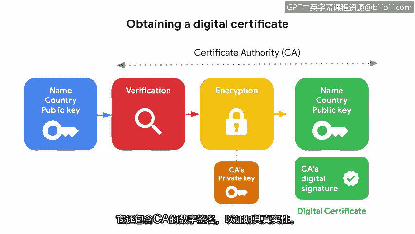

# 016：公钥基础设施 🔐

在本节课中，我们将要学习公钥基础设施（PKI）。这是一种确保在线信息交换安全的加密框架。我们将了解其工作原理、涉及的加密类型，以及它如何通过数字证书解决信任问题。

---

计算机使用多种加密算法来在线发送和存储信息。这些算法在隐藏私人信息方面很有帮助，但前提是它们的密钥得到保护。想象一下，你需要跟踪并保护所有在线个人信息的加密密钥，这几乎是不可能的。幸运的是，我们不必这样做，这要归功于公钥基础设施。

公钥基础设施，简称PKI，是一个确保在线信息交换安全的加密框架。它是一个广泛的系统，使访问和信息传递变得快速、简单且安全。

## PKI的工作原理 🛠️

PKI是一个包含两个步骤的过程。它始于加密信息的交换。

### 第一步：加密信息交换

这个过程涉及非对称加密、对称加密，或两者结合使用。

#### 非对称加密

非对称加密使用一对公钥和私钥来加密和解密数据。我们可以将其想象成一个可以用两把钥匙打开的盒子。

*   **公钥**：只能用于访问盒子上的投递口并向盒内添加物品。由于公钥不能用于取出物品，它可以被复制并分发给世界各地的人，让他们添加物品。
*   **私钥**：可以完全打开盒子，取出里面的物品。只有盒子的主人才拥有这把能解锁的私钥。

使用公钥可以让与你通信的人和服务器看到并发送加密信息，而这些信息只有你能用私钥解密。这种双钥系统使得非对称加密成为一种安全的在线信息交换方式。然而，它也会减慢处理速度。

#### 对称加密

对称加密是一种更快、更简单的密钥管理方法。它使用一个单一的密钥来交换信息。

让我们再次想象那个带锁的盒子。对称加密使用同一把钥匙。主人可以用它打开盒子、添加物品并再次锁上。当他们想共享访问权限时，可以将这把密钥交给其他人做同样的事情。交换单一密钥可能使网络通信更快，但也使其安全性降低。

PKI同时使用非对称加密和对称加密，有时两者结合使用。这完全取决于优先级是速度还是安全性。例如，移动聊天应用程序在对话开始时，当安全性是优先考虑时，会使用非对称加密来建立人与人之间的连接。之后，当来回通信的速度成为优先考虑时，对称加密就会接管。

虽然两者各有优缺点，但它们有一个共同的弱点：在发送方和接收方之间建立信任。

## 建立信任：数字证书 📜

上一节我们介绍了加密交换信息的两种方式。本节中我们来看看PKI如何解决它们共同的信任问题。

这两个过程都依赖于共享密钥，而这些密钥可能被滥用、丢失或被盗。当我们面对面交换信息时，这不是问题，因为我们可以用感官来区分我们信任的人和不信任的人。然而，计算机本身并不具备这种区分能力。这就是PKI第二步发挥作用的地方。

PKI通过在计算机和网络之间使用数字证书系统来建立信任，从而解决密钥共享的脆弱性。

数字证书是一个验证公钥持有者身份的文件。大多数在线信息交换都使用数字证书。用户、公司和网络都持有一个数字证书，当在线通信时，它会验证他们，作为一种表示信任的方式。

以下是数字证书如何创建的示例：

假设一家在线企业即将推出其网站，并希望获得一个数字证书。当他们注册域名时，托管公司会将某些信息发送给一个受信任的证书颁发机构（CA）。提供的信息通常是基本信息，如公司名称及其总部所在国家。同时也会提供网站的公钥。

然后，证书颁发机构使用这些数据来验证公司的身份。确认后，CA会用自己的私钥加密这些数据。最后，他们创建一个包含加密公司数据的数字证书。该证书还包含CA的数字签名，以证明其真实性。

数字证书很像一个在线使用的数字身份徽章，用于限制或授予对信息的访问权限。这就是PKI解决信任问题的方式。

结合非对称加密和对称加密，这种在可信来源之间交换安全信息的两步法，使得PKI成为一种非常有用的安全控制措施。

---

本节课中我们一起学习了公钥基础设施（PKI）。我们了解到PKI通过结合使用非对称加密和对称加密来安全地交换信息，并通过数字证书系统在通信双方之间建立信任，从而构成了现代网络安全通信的基石。