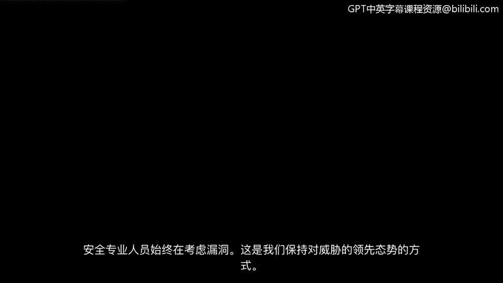
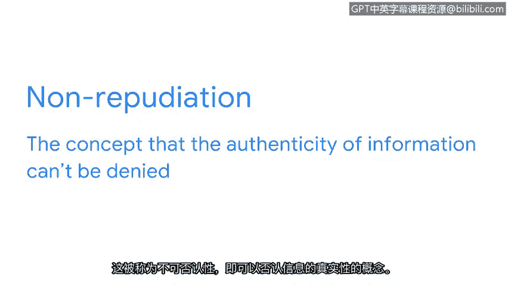
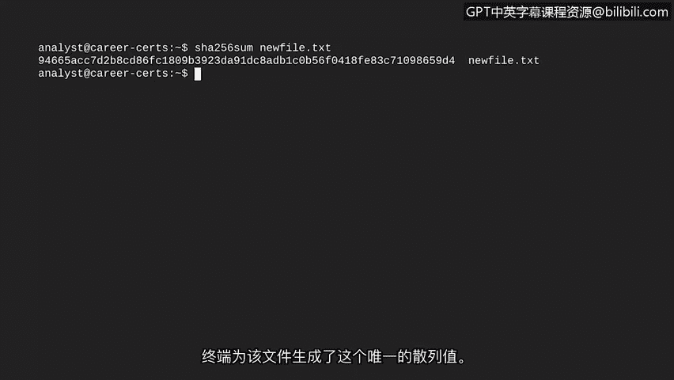

# 017：不可否认性与散列函数

在本节课中，我们将要学习一种重要的安全控制措施——散列函数。我们将了解它如何确保数据的完整性，并帮助安全专业人员识别恶意软件和未经授权的文件修改。

## 概述：安全控制与数据完整性

上一节我们探讨了对称和非对称加密。本节中，我们来看看另一种不涉及密钥的安全控制：散列函数。安全专业人员始终在思考漏洞，这是我们领先于威胁的方式。我们之前探讨的两种加密形式在通信信息时会共享密钥。加密密钥存在丢失或被盗的风险，这可能导致敏感信息泄露。让我们探索另一种安全控制，它可以帮助公司解决这个弱点。

## 什么是散列函数？

散列函数是一种能产生无法解密的代码的算法。与不对称和对称算法不同，散列函数是单向过程，不生成解密密钥。相反，这些算法会生成一个唯一的标识符，称为**散列值**或**摘要**。

以下是其工作原理的一个示例：
想象一家公司有一个供员工使用的内部应用程序，它存储在共享驱动器中。通过散列函数处理后，该程序会获得其散列值。出于示例目的，我们使用MD5散列函数创建了这个相对较短的散列值。通常，能产生更长散列值的标准散列函数因其更安全而更受青睐。

## 散列函数如何确保完整性？

接下来，假设攻击者用一个执行恶意操作的修改版本替换了该程序。恶意程序可能像原始程序一样工作。然而，即使只有一行代码与原始代码不同，它也会产生一个不同的散列值。通过比较散列值，我们可以验证程序是不同的。攻击者经常使用此类技巧，因为它们很容易被忽视。幸运的是，散列值可以帮助我们识别此类事件的发生。

在安全领域，散列主要用于确定文件和应用程序的完整性。数据完整性关系到信息的准确性和一致性。这被称为**不可否认性**，即信息的真实性无法被否认。散列函数是实现数据完整性证明的重要安全控制，分析师们经常使用它们。

## 实践应用：使用散列值进行分析

以下是分析师使用散列的一种方式：查找文件或应用程序的散列值，并将其与已知的恶意文件进行比较。

例如，我们可以使用Linux命令行来生成计算机上任何文件的散列值。我们只需启动shell并输入要使用的散列算法名称。在本例中，我们使用一种常见的算法，称为SHA-256。接下来，我们需要输入要计算散列值的任何文件的文件名。

让我们对 `newfile.txt` 文件的内容进行散列计算。现在，我们按回车键。终端会为该文件生成这个唯一的散列值。

这些工具生成的散列值可以与已知的在线病毒散列值进行比较。其中一个这样的数据库是VirusTotal。这是安全从业者中流行的工具，可用于分析可疑文件、域名、IP地址和URL。

## 散列函数的设计与不可否认性

正如我们所探讨的，即使输入发生最微小的变化，也会导致完全不同的散列值。散列函数被特意设计成这样，以协助处理不可否认性问题。它们为计算机提供了一种快速简便的方法来比较输入和输出值，并验证数据完整性。

## 总结

本节课中，我们一起学习了散列函数的概念及其在网络安全中的关键作用。我们了解到，散列函数是一种单向算法，能生成唯一的散列值，用于验证数据的完整性，防止文件被篡改，并支持不可否认性。通过命令行工具和在线数据库（如VirusTotal）的实际应用，安全专业人员可以有效地利用散列值来识别恶意软件和确保系统安全。