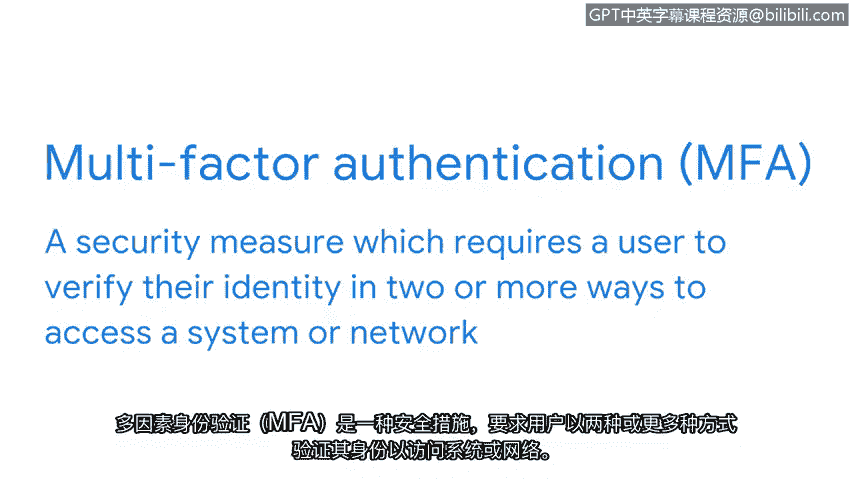

# 018：访问控制和认证系统 🔐

在本节课中，我们将要学习访问控制的基础知识，特别是认证系统。认证是信息安全的第一道防线，它负责确认试图访问信息的人或物的身份。我们将探讨认证的不同因素、单点登录技术以及多因素认证如何共同作用，以在提供便利的同时确保安全。

保护数据是安全控制的基本功能。在确保信息安全方面，哈希和加密是强大但有限的工具。管理谁或什么可以访问信息同样是保障信息安全的关键。

接下来我们将探讨的一系列控制措施是访问控制，即管理信息访问、授权和责任制的安全控制。如果实施得当，访问控制可以维护数据的**机密性、完整性和可用性**。它们还能让用户快速获取所需信息。

这些系统通常被分解为三个独立但相关的功能，即**认证、授权和记账框架**。每个控制都有其自身的协议和系统来实现其功能。

在本视频中，我们先来熟悉列表中的第一个基础概念：认证。

## 认证系统

认证系统是一种访问控制，其目的非常基本。它们会向任何试图访问信息的对象提出一个简单的问题：**“你是谁？”**

组织根据其安全策略的目标，以不同的方式收集这个问题的答案。有些方式比其他方式更彻底，但总的来说，对这个问题的回答可以基于以下三个认证因素。

以下是三种主要的认证因素：

*   **知识**：基于知识的认证指的是用户知道的东西，例如密码或他们之前提供的安全问题的答案。
*   **所有权**：基于所有权的认证指的是用户拥有的东西。一种常用的基于所有权的认证类型是一次性密码或**OTP**。你可能在某些时候体验过这种认证方式。它是一个随机数字序列，应用程序或网站会通过短信或电子邮件发送给你，并要求你提供。
*   **特征**：基于此因素的认证指的是用户本身具有的特征。例如，智能手机上的指纹扫描等生物识别技术就是这种认证类型的例子。虽然并非无处不在，但这种认证形式正变得越来越普遍，因为与模仿密码相比，如果犯罪分子必须模仿指纹或面部扫描来冒充某人，难度要大得多。

认证过程中提供的信息需要与存档的信息相匹配，这些访问控制才能生效。当凭证不匹配时，认证失败，访问被拒绝。当凭证匹配时，访问被授予。

错误地拒绝访问可能会让任何人感到沮丧。为了使访问系统更加方便，如今许多组织都依赖单点登录。

## 单点登录

**单点登录**或**SSO**是一种将多个不同登录合并为一个的技术。

你能想象每次与朋友见面时都必须重新自我介绍吗？这正是SSO所解决的问题。SSO无需用户反复进行身份验证，而是**一次性确认其身份**，从而允许他们更快地获得对公司资源的访问权限。

虽然SSO系统在加快认证过程方面很有帮助，但当单独使用时，它们会带来一个显著的漏洞。

拒绝授权用户的访问可能会令人沮丧。但你知道更糟糕的是什么吗？错误地向错误的用户授予访问权限。SSO技术很棒，但如果它只依赖单一的认证因素，那就不够安全了。

## 多因素认证

添加更多的认证因素可以加强这些系统。**多因素认证**或**MFA**是一种安全措施，它要求用户通过两种或更多方式来验证其身份，以访问系统或网络。

**MFA**结合了两个或更多独立的凭证，例如知识和所有权，来证明某人就是他们所声称的身份。

SSO和MFA经常结合使用，以增强认证系统的防御能力。当两者同时使用时，组织可以确保访问既方便又安全。

现在我们已经介绍了认证。我们准备好探索该框架的第二部分了。接下来，我们将学习授权。

---

本节课中我们一起学习了访问控制中的认证系统。我们了解了认证的三个基本因素：**知识、所有权和特征**。我们还探讨了**单点登录**如何简化访问流程，以及**多因素认证**如何通过结合多种验证方式来显著提升安全性。理解这些基础概念是构建强大信息安全体系的关键一步。