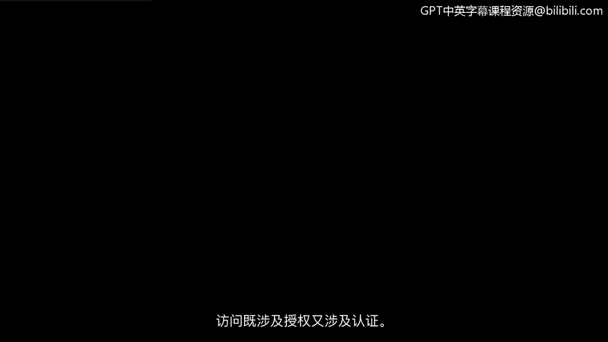
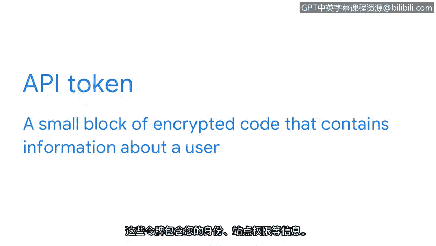

# 019：授权机制 🔐

在本节课中，我们将要学习访问控制中的授权机制。我们将了解授权如何与认证协同工作，以及如何通过最小权限和职责分离等安全原则来保护系统和数据。

---

访问控制既关乎认证，也关乎授权。访问控制最重要的功能之一，是它们如何为特定系统和流程分配责任。

在我们探索访问控制系统的过程中，接下来要了解的是授权机制。这些协议实际上与认证技术紧密合作：一个验证用户身份，另一个则决定他们被允许做什么。让我们来看看保护私人信息的认证、授权和计费框架的下一部分。

之前，我们学习了最小权限原则。授权与“信息访问权限仅在需要时有效”这一理念相关联。授权系统也深受这一理念的影响，同时还受到另一个重要安全原则的影响：职责分离。

职责分离原则是指，不应授予用户可能允许其滥用系统的授权级别。分离职责可以降低系统故障和用户不当行为的风险。

以下是职责分离原则的两个应用示例：
*   一个负责提供客户服务的人，不应同时被授权评估自己在该职位上的表现。否则，他们很容易玩忽职守，同时在没有监督的情况下继续给自己打高分。
*   同样，如果一个人被授权开发和测试一个安全系统，他们更有可能忽视其弱点。

最小权限原则和职责分离概念不仅适用于人，也适用于所有系统，包括网络、数据库、流程和组织的任何其他方面。

最终，授权取决于系统或用户的角色。在保护网络数据安全方面，有几个常用的访问控制你应该熟悉：HTTP 基本认证和 OAuth。

你是否曾想过网址中的“HTTP”代表什么？它代表超文本传输协议，这是通过网络建立通信的方式。HTTP 使用一种称为**基本认证**的技术来建立用户访问服务器的请求。

基本认证的工作原理是，每当用户与网页通信时都发送一个标识符。一些网站仍使用基本认证来判断某人是否有权访问该网站上的信息。然而，该协议被认为容易受到攻击，因为它通过网络明文传输用户名和密码。

如今大多数网站使用 HTTPS 代替，它代表**安全超文本传输协议**。该协议在网络通信时不会暴露访问凭证等敏感信息。

当今使用的另一种安全认证技术是 **OAuth**。OAuth 是一种开放标准的授权协议，用于在应用程序之间共享指定的访问权限。

以下是 OAuth 的一个应用示例：
*   你可以授权 Google 允许另一个网站访问你的个人资料来创建账户，而不是通过网络请求和发送敏感的用户名和密码。OAuth 使用 **API 令牌** 来验证你与其服务提供商之间的访问。

一个 **API 令牌** 是一小段加密代码，包含有关用户的信息。这些令牌包含你的身份、网站权限等信息。OAuth 通过将 API 令牌从服务器传递到用户设备来发送和接收访问请求。

让我们探索一下幕后的过程。当你授权一个网站使用你的 Google 个人资料创建账户时，Google 所有常规的登录协议仍然有效。如果你的账户启用了多因素认证（你应该启用），你仍然能获得它提供的安全优势。API 令牌在很大程度上降低了风险。这些 API 令牌作为额外的加密层，有助于在另一个平台发生泄露时保护你的 Google 密码安全。

基本认证和 OAuth 只是众多授权工具中的两个例子，它们的设计都遵循了最小权限和职责分离的原则。还有许多其他控制措施有助于限制未经授权访问信息的风险。

除了控制访问，监控访问同样重要。在下一个视频中，我们将聚焦于认证、授权和计费框架的第三个也是最后一个部分。

---

本节课中，我们一起学习了授权机制的核心概念。我们了解到授权与认证相辅相成，共同决定用户能做什么。通过最小权限和职责分离原则，授权系统可以有效地限制访问，降低风险。我们还介绍了 HTTP 基本认证、HTTPS 和 OAuth 等具体技术，理解了 API 令牌在安全授权中的作用。最后，我们认识到监控访问与控制访问同等重要，为后续学习计费部分做好了准备。