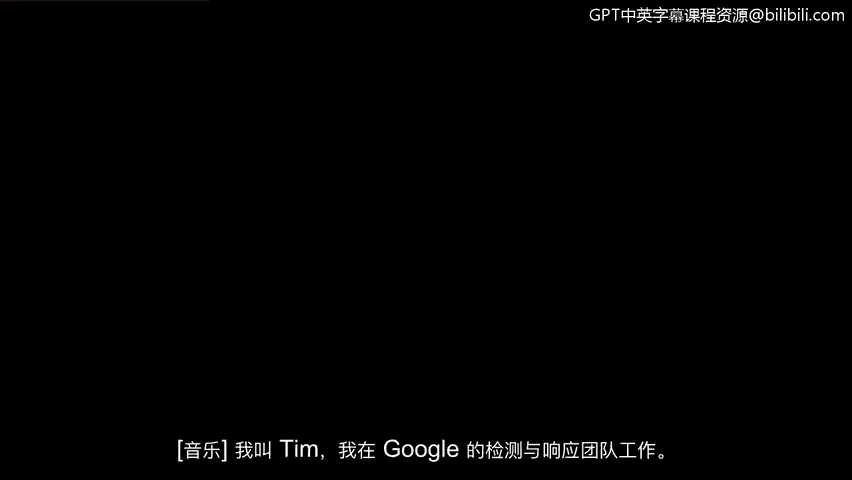
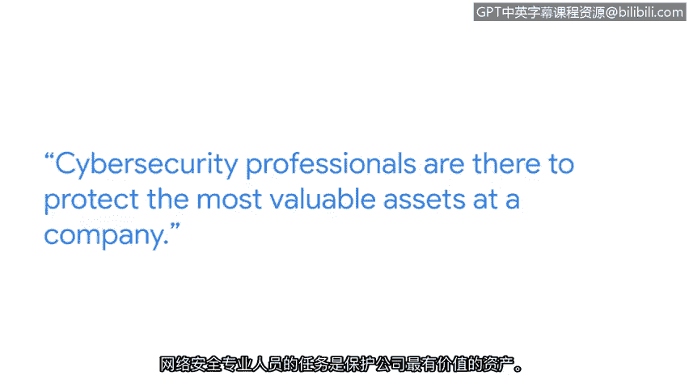

**谷歌网络安全专业证书课程：第五课：资产、威胁和漏洞**

**概述**
在本节课中，我们将学习网络安全的核心目标——保护资产。我们将通过谷歌安全团队成员的视角，理解资产保护的重要性、网络安全职业的意义以及该领域的职业前景。

---

**P21：蒂姆：在保护资产中寻找目标**

我的名字是蒂姆，我在谷歌的事件检测与响应团队工作。

你可以把我们想象成谷歌的烟雾探测器和消防部门。我们的工作是检测可能影响谷歌及其用户的有害活动。

这里的风险非常高。想象一下你在谷歌上拥有的东西，无论是文档、图片、你的财务信息，还是你的一些秘密，那些你不想让任何人知道的事情。这些正是我们要保护的东西。

网络安全专家的职责就是保护公司最有价值的资产。你将负责保护它们。你所做的工作与公司认为最重要、最有价值并需要保护的东西直接相连，我认为这为从业者提供了强烈的目标感、巨大的动力，并为构建一个非常令人满意的职业生涯奠定了坚实基础。

网络安全是一个回报丰厚的职业。它是一个在许多许多公司都至关重要的职能。

并且这是一个需求量很高的职业，市场上绝对缺乏有才华的劳动力。因此，从这个角度来看，如果你正在寻找一条通往可行、长期且有回报的职业道路，这无疑是一条非常清晰的路径。

---

**总结**
本节课中，我们一起学习了网络安全的核心使命是保护数字资产。通过了解安全团队如何像“烟雾探测器”和“消防部门”一样工作，我们认识到保护用户数据（如文档、财务信息等）的重要性。这种将个人工作与保护公司核心价值直接关联的特性，使得网络安全成为一个目标明确、需求旺盛且极具成就感的职业领域。