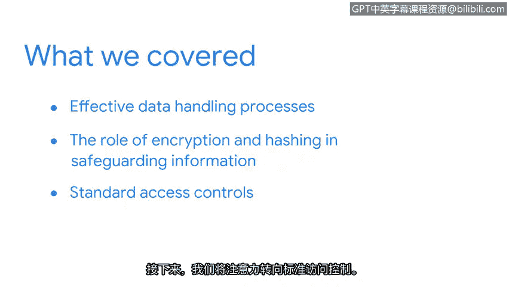

# 022：总结

在本节课程中，我们学习的核心主题是**保护资产**，这与隐私权密切相关。每个人都应享有决定谁能访问自己信息的权利。我们将了解多种有助于保护资产的安全控制措施。

上一节我们介绍了有效的数据处理流程，其基础是**最小权限原则**。本节中，我们来看看加密和哈希在保护信息方面扮演的角色。

## 🔐 加密与哈希的作用

我们探讨了对称加密与非对称加密的工作原理，以及哈希如何进一步保护数据免受损害。

*   **对称加密**使用同一个密钥进行加密和解密，其过程可以表示为：`密文 = 加密(明文, 密钥)`。
*   **非对称加密**使用一对密钥：公钥和私钥。公钥用于加密，私钥用于解密。
*   **哈希**是一种单向函数，将任意长度的数据映射为固定长度的字符串（哈希值），用于验证数据完整性。其过程可以表示为：`哈希值 = 哈希函数(数据)`。

## 🔑 标准访问控制

随后，我们将注意力转向标准访问控制。正确地验证用户身份并授予其相应权限，是维护信息**CIA三要素**（机密性、完整性、可用性）的核心。

我们使用**AAA安全框架**（认证、授权、计账）来详细审视身份与访问管理系统，以及用于验证用户身份真伪的访问控制机制。

---

## 🎉 课程进展与展望

做得好！你已经完成了本课程前半部分的学习。到目前为止，你取得了巨大的进步，希望你继续保持。

请记住，你的背景和经验在这个领域非常有价值。结合我们目前所学的概念，你将能成为任何安全团队中有价值的贡献者。

至此，我们一直在探索安全的防御层面。但安全不仅仅是提前规划和等待事件发生。

在接下来的学习旅程中，我们将从攻击者的视角更主动地审视安全，继续培养安全思维模式。我们下一部分再见。