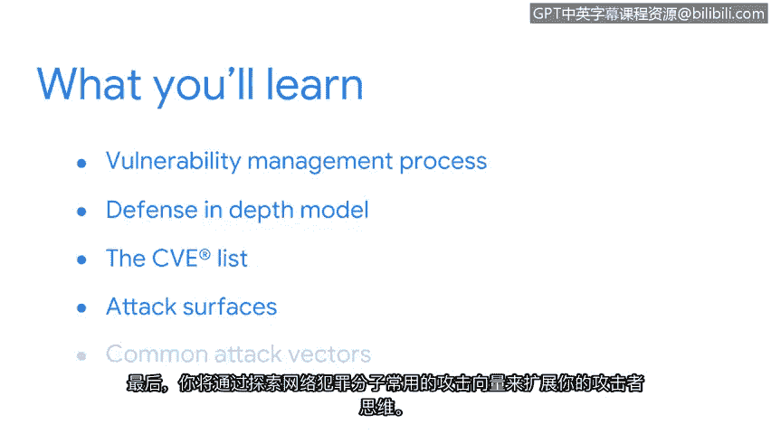

# 023：欢迎来到第三周

在本节课中，我们将回顾前两周的学习内容，并概述第三周的核心学习目标。我们将聚焦于**漏洞管理**，了解其重要性、基本模型以及安全分析师在其中扮演的关键角色。

我们已经共同完成了许多内容。很难相信我们已经到达了本课程的中点。

我希望你对这个令人兴奋的领域及其提供的机会有了更清晰的认识。最重要的是，我希望你乐在其中。

我们的起点已经相去甚远。当我们一起开始这段旅程时，我们认识了每个安全计划的三个基本构建模块：**资产**、**威胁**和**漏洞**。

我们早期重点讨论了**资产**，以及安全专业人员致力于保护的广泛事物。随后，我们将注意力转向了资产安全的一个核心组成部分：**保护资产**。你了解了保护敏感信息的重要性。你也学习了一些防止信息丢失或被盗的安全控制措施。

在接下来的旅程中，我们将把焦点转向**漏洞**。我们保护的每一项资产都有一系列我们需要意识到的漏洞或缺陷。及时了解这些情况是保护个人和组织免受伤害的关键部分。

在课程的下一部分，你将理解漏洞管理的过程。首先，你将探索一种常见的漏洞管理方法：**纵深防御模型**。

然后，你将学习漏洞如何在诸如 **CVE列表** 这样的在线库中被记录。我们将讨论安全团队保护的**攻击面**。最后，你将通过探索网络犯罪分子试图利用的常见**攻击向量**，来扩展你的攻击者思维。

安全分析师在识别和纠正系统漏洞方面扮演着重要角色。我知道我很期待继续探索。你呢？那么，我们开始吧。

---

本节课中，我们一起回顾了资产与威胁的基础，并引入了第三周的核心主题——**漏洞管理**。我们了解到，识别和管理资产中的漏洞是安全工作的关键。接下来，我们将深入学习纵深防御模型、CVE数据库、攻击面与攻击向量等核心概念，为成为一名合格的安全分析师打下坚实基础。