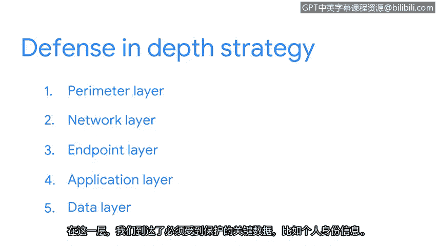

# 025：深度防御策略

在本节中，我们将学习一种重要的安全模型——深度防御。我们将了解其核心概念、分层结构以及每一层如何协同工作来保护关键资产。

## 概述：什么是深度防御？🛡️

深度防御是一种安全模型，它利用分层防御的概念来降低风险。当一个屏障失效时，另一个屏障会接替其位置以阻止攻击，这使得攻击者难以穿透整个防御体系。

这种模型常被称为“城堡式防御”，因为它类似于中世纪城堡的多层防御结构。

## 城堡式防御的类比 🏰

在中世纪，城堡的结构非常难以攻破。它们具备多种不同的防御措施，每一层都为攻击者带来了独特的挑战。

以下是城堡防御的几个关键层次：

*   **护城河**：一条环绕城堡的水域屏障，能阻止大规模攻击者接近城墙。
*   **巨石城墙**：即使少数士兵通过了第一层防御，他们还将面临高耸石墙的挑战。其弱点是可能被攀爬。
*   **瞭望塔**：如果攻击者试图利用攀爬的弱点，他们将遭遇另一层防御——塔楼中随时准备射箭的守卫。

城堡的每一层防御都通过识别漏洞并实施安全控制来最小化攻击风险。即使一个系统失效，其他层仍能提供保护。

## 深度防御的五层模型 🧱

深度防御模型以类似的方式运作，主要用于网络安全领域，通过一个五层设计来保护信息。信息在网络中交换时，会进出这五个层级，每一层都包含一系列安全控制措施。

上一节我们通过城堡的例子理解了分层防御的理念，本节中我们来看看它在网络安全中的具体应用。

以下是深度防御模型的五个层级：

*   **外围层**：这是第一层防御，主要功能是用户认证，过滤外部访问。其核心是只允许受信任的伙伴访问下一层。关键技术包括**用户名和密码**。
*   **网络层**：这一层更侧重于授权，由**网络防火墙**等技术构成。
*   **终端层**：终端指的是可以访问网络的设备，例如**笔记本电脑、台式机或服务器**。保护这些设备的技术包括**防病毒软件**。
*   **应用层**：这一层包括所有用于与技术交互的界面。安全措施被编程为应用程序的一部分。一个常见的例子是**多因素认证**，例如需要同时输入密码和短信验证码。
*   **数据层**：这是第五层，也是最后一层防御，我们在此抵达必须保护的关键数据，例如个人身份信息。在这一层，**资产分类**是一项重要的安全控制。

## 总结与回顾 📚

本节课中，我们一起学习了深度防御策略。我们了解到，深度防御是一个分层的安全模型，通过设置多重屏障来保护资产。即使某一层防御被突破，其他层仍能提供保护，从而显著降低整体风险。

除了我们提到的少数例子，深度防御模型还包含许多其他的安全控制措施。许多企业都采用深度防御模型来设计其安全系统。理解这个框架，能帮助你更好地把握一个组织的各项安全控制措施是如何协同工作，以保护重要资产的。