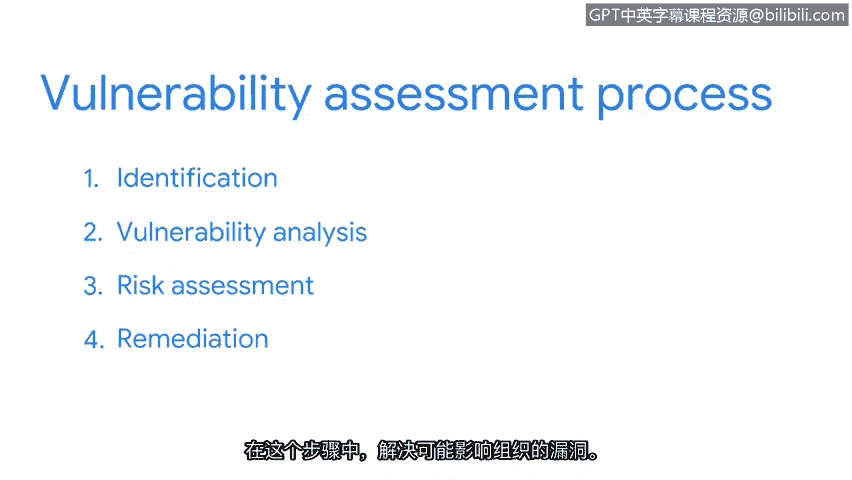

# 027：漏洞评估

在本节课中，我们将要学习漏洞管理流程中的一个核心环节——漏洞评估。我们将了解其定义、目标、执行原因以及标准化的四步流程。

## 概述

到目前为止，我们对漏洞管理流程的探讨主要集中在几个主题上。我们讨论了漏洞如何影响防御体系的设计，也探讨了常见漏洞是如何被共享的。一个我们尚未涉及的话题是：漏洞最初是如何被发现的。

漏洞和缺陷通常是在**漏洞评估**过程中被发现的。漏洞评估是一个组织对其安全系统进行内部审查的过程。这些评估与识别和分类CVE列表上漏洞的过程类似，主要区别在于，组织的安全团队会自行执行、评估、评分并修复这些漏洞。安全分析师在整个过程中扮演着关键角色。总体而言，漏洞评估的目标是识别薄弱环节并预防攻击。这也是安全团队判断其安全控制措施是否符合监管标准的方式。

组织之所以频繁进行漏洞评估，是因为公司有大量资产需要保护。安全团队有时需要通过漏洞评估来选择需要重点关注的领域。

## 漏洞评估的四步流程

一旦确定了评估重点，漏洞评估通常遵循一个四步流程。

以下是漏洞评估的四个核心步骤。

1.  **识别**
    在此步骤中，使用扫描工具和手动测试来发现漏洞。其目标是了解安全系统的当前状态，就像为其拍一张快照。识别步骤结束后，通常会出现大量的发现结果。

2.  **漏洞分析**
    在此步骤中，对已识别的每个漏洞进行测试。就像扮演数字侦探一样，漏洞分析的目标是找到问题的根源。

3.  **风险评估**
    在此步骤中，为每个漏洞分配一个分数。这个分数基于两个因素来评定：如果该漏洞被利用，其影响的严重程度；以及这种情况发生的可能性。在前两个步骤中发现的漏洞数量常常超过可修复它们的人员数量。风险评估是一种根据分数来优先分配资源、处理需要解决的漏洞的方法。

4.  **修复**
    这是漏洞评估的第四步也是最后一步。在此步骤中，处理那些可能对组织造成影响的漏洞。修复工作根据风险评估步骤中分配的严重性分数来展开。这部分流程通常是安全人员与IT团队共同努力，为之前发现的漏洞制定最佳修复方案。

修复步骤的示例可能包括：强制执行新的安全程序、更新操作系统或实施系统补丁。

## 总结

本节课中，我们一起学习了漏洞评估。漏洞评估非常适合识别系统的缺陷，大多数组织用它来主动搜索问题。😊

但是，我们如何知道该从哪里开始搜索呢？下次我们将一起探讨公司是如何解决这个问题的。