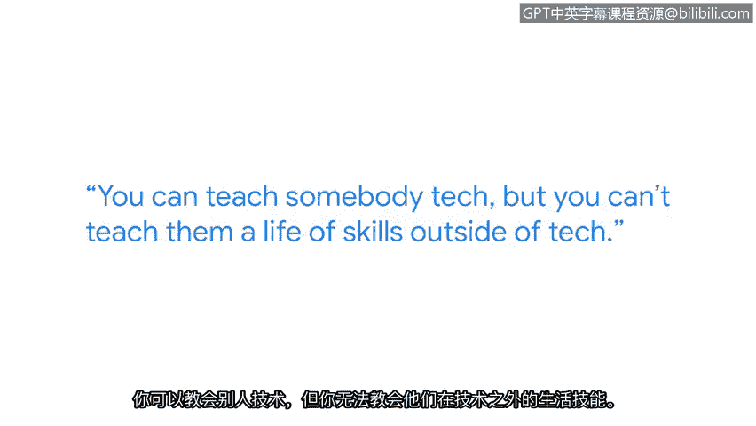

# 028：奥马德在网络安全中的学习之旅

在本节中，我们将跟随奥马德的故事，了解他从一名狱警转型为谷歌企业运营工程师的独特旅程。他的经历将向我们展示，非技术背景的经验如何转化为网络安全领域的宝贵技能。

我的名字是奥马德。我是谷歌的一名企业运营工程师。我的全部工作就是解决问题。谷歌员工会遇到问题。他们需要找人沟通。通常他们会来找我们。

如果你在我18岁时问我，我将来会在哪里。我绝不会告诉你我会成为一名安全工程师。我可能会告诉你，我会在监狱工作，或者成为一名警察。在某个小镇，做着朝九晚五的常规工作。

高中毕业后，我去了新泽西州唯一一所最高安全级别的监狱——特伦顿州立监狱工作。压力非常大，但与此同时，那是我当时想做的事情。或者至少，我当时认为那是我想做的。

在成为一名惩教官五年后，我再次参加了警长警官的考试。在那所培训学院的最后一天，我决定这并不适合我。我厌倦了趴在地上做俯卧撑。我厌倦了被人大声呵斥。

我回到家，做了每个人都会做的事：进行谷歌搜索。我看到了一个谷歌的职位。一个驻留计划排在搜索结果前列，我抱着试试看的心态申请了。我甚至告诉当时的朋友们：“我要申请这个，但我肯定进不去。”

我没有任何推荐人，没有任何人脉。我根本不认识任何在谷歌工作的人。几天之内，一位招聘人员联系了我。她说：“我认为你非常合适。你是一位转行者。我喜欢你的申请和简历。我认为你会非常合适。”

所有的面试官都喜欢我的背景。他们欣赏我自学了很多东西，很多面试官能与我的经历产生共鸣。他们说：“嘿，我也做过同样的事。” 从那时起，我得到了这份工作，并开始了我的职业生涯。

当我参加入职培训时，坐在我旁边的人实际上是普林斯顿大学的优秀毕业生。而我，没有大学学位，没有相关背景，没有工作经验，却进入了同一家公司。

对于转行者而言，你拥有别人没有的东西：一种不同的思维方式。你来自技术领域之外的经验，可以转移到技术领域中来。不要忘记，我们都拥有能在这个领域帮助你的技能组合。这正是雇主和招聘经理所寻找的。

作为一名惩教官，我学到的一件事是如何评估风险。每种情况都不同。就像安全领域一样。每种风险都不同。每个漏洞都不同。每个威胁都不同。你可以教别人技术。但你无法教给他们技术之外的人生技能。

如果我能打电话给18岁的自己，给他一条建议。那会是：不要害怕。去做吧。网络安全领域的职业生涯非常有趣。它非常吸引人。它会锻炼你的大脑。它改变了我的生活。它同样也会改变你的生活。

在本节中，我们一起学习了奥马德从执法领域成功转型至科技行业的故事。他的经历有力地证明了，风险评估、问题解决和独特的视角等软技能，与专业技术知识同等重要。对于任何考虑进入网络安全领域的人，尤其是非传统背景的转行者，他的核心建议是：拥抱你的独特经历，不要畏惧挑战。