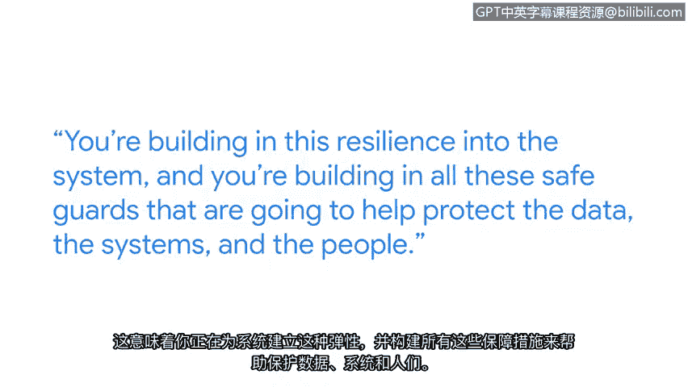

# 030：采用攻击者思维 🧠

在本节课中，我们将学习如何“采用攻击者思维”。这是一种从潜在攻击者的角度审视和分析系统安全性的关键方法。通过模拟攻击者的思路，安全专业人员能够更有效地发现和修复漏洞，从而构建更具韧性的防御体系。

## 认识红队与攻击者思维

我是尼鲁，负责领导谷歌的红队。谷歌的红队负责模拟试图入侵谷歌的攻击者。

红队是蓝队的陪练伙伴。蓝队是负责构建安全控制措施、检测管道或响应安全事件的团队。我们通过模拟对手来帮助测试所有这些防御体系。我们入侵谷歌，是为了让入侵谷歌变得更困难。这就像是，我们发现你的系统存在这些问题，现在提供一些建议，并帮助你修复它们。

## 什么是攻击者思维？

采用攻击者思维，意味着像对手一样去处理问题。

我个人倾向于采用攻击者思维。这始于我的童年，当时我玩电子游戏时，总会问自己：我必须按照游戏设计的方式通关吗？我必须走标准路径达成目标吗？审视一个系统并提出问题：我能入侵它吗？我该如何入侵？哪些地方可能会失败？这能给我带来什么？这关乎拆解系统并试图理解它。

## 攻击者思维的重要性

逆向思维是安全专业人员几乎所有工作的核心。

它关乎挑战假设。它关乎从不同视角看待事物，而不是从开发者的视角出发——开发者思考的是如何构建一个能为用户工作的系统。而你则戴上攻击者的帽子，思考：如果我审视这个系统，我会如何入侵它？

对于安全专业人员而言，采用攻击者思维非常重要，因为这样你能编写更具防御性的代码，构建更具防御性的系统，并以更具攻击性的方式去破坏系统。这意味着你在系统中构建了韧性，并建立了各种防护措施，以帮助保护数据、系统和人员。

## 如何培养攻击者思维

为了培养我的攻击者思维，我过去常常去请教他人。这意味着我可以占用他们的时间，询问：嘿，你是如何审视这个系统的？你做了哪些假设？你如何构建你所考虑的安全防护措施？

对于试图培养攻击者思维的人，我的建议是：去和人们交流。无论是在本地聚会、会议上，还是为自己找一个CTF小组，和他们一起参加这些竞赛。观察团队中的每个人如何处理特定问题并寻求解决方案。

## 网络安全的意义

如今，我们日常所做的几乎所有事情都在线上进行，例如网上银行、网上杂货购物。电网、供水系统也是如此。所有这些都在短时间内实现了数字化。现在人们开始退一步思考：这对我们意味着什么？而网络安全工作者，正是帮助确保这些系统被锁定并受到保护，以抵御这些对手的人。

如果你充满好奇心，喜欢拆解事物，喜欢解决问题，并希望帮助确保事物安全，那么你应该加入网络安全领域。

## 总结

本节课中，我们一起学习了“采用攻击者思维”这一核心安全理念。我们了解了红队的作用、攻击者思维的定义及其重要性，并探讨了通过交流和实践来培养这种思维的方法。最后，我们认识到在万物互联的时代，具备这种思维对于保护关键基础设施和数字生活至关重要。