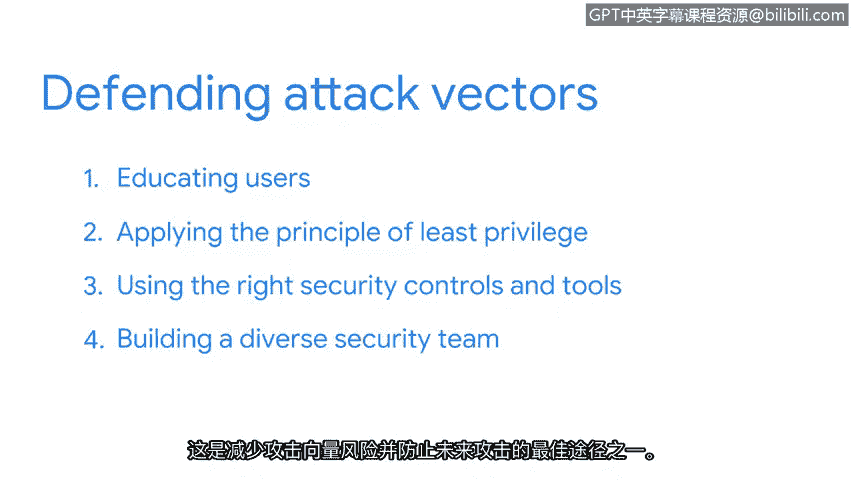

# 031：防御路径

在本节课中，我们将学习如何通过理解攻击路径来构建有效的网络防御。我们将探讨攻击向量的概念、如何以攻击者思维进行分析，以及组织可以采取哪些关键措施来保护其资产。

## 理解攻击向量 🎯

上一节我们探讨了云技术如何扩展了组织的数字攻击面。本节中，我们来看看攻击者可能利用的具体路径。

为了防御攻击，组织不仅需要理解其周围不断发展的数字环境，还需要了解可能针对他们使用的攻击类型。云计算导致了可用攻击向量数量的增加。

**攻击向量**指的是攻击者用来渗透安全防御的途径，就像房屋的门窗。这些途径是攻击面上可利用的特性。

以下是一些攻击向量的例子：
*   **社交媒体**：员工可能无意或有意地泄露敏感信息。
*   **可移动介质**：如USB驱动器，可能被用于传播恶意软件。

## 谁在使用攻击向量？👥

大多数人认为只有网络犯罪分子才会利用攻击向量。虽然恶意黑客确实利用它们来窃取信息，但其他群体也会使用。

例如，员工偶尔会无意中利用攻击向量。这在社交媒体平台上经常发生，员工有时会发布本不应分享的敏感公司新闻。

同样的事情也可能故意发生。心怀不满的员工会利用社交媒体等向量，故意分享可能损害公司的机密信息。

我们都应将攻击向量视为资产安全的关键风险。

## 采用攻击者思维 🧠

攻击者通常在实施攻击前会投入大量精力进行策划。作为安全专业人员，我们的责任是投入更多努力来阻止他们。

安全团队通过以攻击者思维思考每个向量来实现这一点。这从一个简单的问题开始：**我们将如何利用这个向量？**

我们通过一个逐步的过程来回答这个问题。以下是分析步骤：

1.  **识别目标**：这可以是特定信息、系统、个人、团体或组织本身。
2.  **确定访问方式**：基于哪些可用信息，攻击者可能利用它来接近目标。
3.  **评估可利用的攻击向量**：找出可以用于获得入口的攻击向量。
4.  **寻找攻击工具和方法**：攻击者将使用什么来实施攻击。

在此过程中，实践攻击者思维为实施最佳安全控制和监控需要关注的漏洞提供了宝贵的见解。

## 防御攻击向量的通用规则 🛡️

每个组织都有一长串需要防御的攻击向量。虽然保护方法有很多，但有一些通用的规则。

以下是防御攻击向量的关键措施：

*   **用户安全教育**：关键之一是教育用户了解安全漏洞。这些努力通常与特定事件相关联，例如，告知他们一种针对组织用户的新型网络钓鱼攻击。
*   **应用最小权限原则**：我们在本节前面探讨过最小权限原则。其核心思想是访问权限应仅限于执行任务所需的范围。正如我们之前探讨的，这种做法可以关闭组织攻击面内的多个安全漏洞。
*   **使用正确的安全控制和工具**：即使知识最渊博的员工也会犯安全错误，例如不小心点击电子邮件中的恶意链接。部署正确的安全工具，如防病毒软件，有助于更有效地防御攻击向量，并降低人为错误的风险。
*   **建立多元化的安全团队**：这是降低攻击向量风险和预防未来攻击的最佳方法之一。你独特的视角可以极大地提高安全团队应用攻击者思维的能力，从而领先于潜在威胁一步。

在本领域中，保持信息灵通始终很重要。你已经有了一个良好的开端，请继续保持。

## 总结 📝

本节课中，我们一起学习了网络防御的核心路径。我们明确了**攻击向量**是攻击者利用的途径，如社交媒体或USB设备。我们掌握了通过**攻击者思维**（识别目标、确定访问方式、评估向量、寻找工具）来分析威胁的方法。最后，我们了解了防御的四大通用规则：**用户教育**、**应用最小权限原则**、**部署正确安全工具**以及**建立多元化安全团队**。理解并应用这些概念，是构建有效网络安全防御的基础。