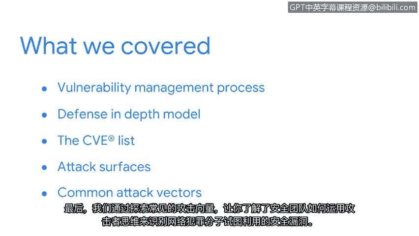

# 032：总结

在本节课中，我们学习了关于漏洞管理的核心知识，并探讨了数字世界的复杂性。现在，我们来到了本节的结尾。

我们共同探索了漏洞的世界。希望你同样有所收获，并对数字世界的复杂环境有了更清晰的认识。这个环境中充满了攻击者可以利用来未经授权访问资产的缺口，这使得防御工作充满挑战。

本次课程我们探讨了大量信息。现在，让我们快速回顾一下所学内容。

以下是本节课程的核心知识点总结：

*   **纵深防御模型**：你学习了纵深防御这一安全框架的各个层级，以及它们如何协同工作以构建更强大的防御体系。
*   **CVE列表**：你了解了安全专业人员用来查找和分类漏洞的CVE（通用漏洞披露）列表。这是你不断增长的安全工具箱中的一个重要工具。
*   **攻击面**：你认识了企业需要保护的攻击面。我们讨论了物理和数字攻击面，以及保护云环境所面临的挑战。
*   **常见攻击向量**：最后，我们探讨了常见的攻击向量。你学习了安全团队如何运用攻击者思维，来识别网络犯罪分子试图利用的安全缺口。

到目前为止，我们讨论的每一个漏洞都面临着多种威胁。

当我们再次相聚时，我们将通过探索网络犯罪分子常用的特定攻击类型，进一步扩展我们的攻击者思维。我们将研究诸如恶意软件等工具，以及攻击者用来破坏防御系统的技术。通过了解这些工具和策略的工作原理，你将清晰地认识到它们构成的威胁。

最后，我们将通过调查安全团队如何阻止这些威胁损害组织的运营、声誉，以及最重要的——其客户和员工，来结束相关探讨。

你已经取得了出色的进展。当你准备好时，让我们共同完成接下来的旅程。期待再次与你相见。

