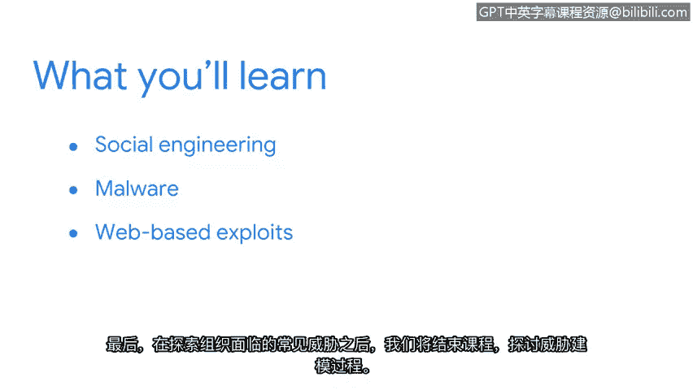

# 033：威胁概览

在本节课中，我们将要学习网络安全中的核心概念之一：威胁。我们将探讨不同类型的威胁，包括社会工程学、恶意软件和基于网络的攻击，并了解威胁建模的基本过程。

---

我们已到达本课程的最后一个部分。到目前为止，你完成得非常出色。投入时间、奉献精神和辛勤工作以达到这一点，确实值得庆祝。

但我们尚未抵达终点。随着课程接近尾声，现在是集中精力、强势收尾的时候。让我们将注意力转向威胁。

我们已经探讨了资产、漏洞以及用于保护两者的控制措施。这两个主题之间的一个共同点是，资产和漏洞的种类繁多。

威胁的世界同样如此。如果你还记得，**威胁**是指任何可能对资产产生负面影响的**情况或事件**。在课程的这一部分，你将通过概览当今组织面临的最危险威胁，来拓展你的安全思维。

首先，我们将从探索社会工程学策略开始。这是攻击者用来获取资产未授权访问的心理欺骗手段。

接下来，我们将探讨一种自个人计算机诞生之初就已存在的常见威胁类型：恶意软件。我们将花些时间研究主要的恶意软件类型。

之后，我们将把注意力转向基于网络的攻击。如今，大多数组织都在数字空间中运营，其中许多组织对此领域还很陌生。在本节课程中，你将了解组织在线上面临的一些最常见威胁。

最后，在探讨了组织处理的常见威胁之后，我们将通过探索威胁建模过程来结束本周内容。

对于安全分析师而言，理解威胁至关重要。内容非常丰富，让我们开始吧。