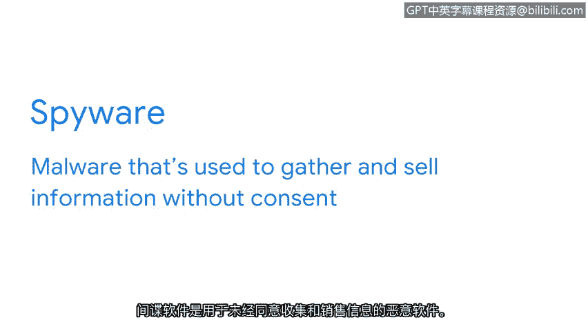

# 036：恶意软件


在本节课中，我们将要学习恶意软件的基本概念及其主要类型。恶意软件是网络安全领域最常见的威胁之一，了解其工作原理是有效防御的第一步。

## 概述：什么是恶意软件？🦠

人与计算机虽然差异巨大，但在一个方面却很相似：我们都容易受到“感染”。人类可能感染引发感冒或流感的病毒，而计算机则可能感染恶意软件。

**恶意软件**是旨在损害设备或网络的软件。其英文“Malware”是“Malicious Software”的缩写。恶意软件可以通过多种方式传播，例如通过受感染的U盘，或更常见地，通过互联网在计算机之间传播。连接到互联网的设备和系统尤其容易受到感染。

当设备被感染后，恶意软件会干扰其正常操作。攻击者利用恶意软件在用户不知情或未经许可的情况下，控制受感染系统。恶意软件长期以来一直是个人和组织的重大威胁。

## 恶意软件的主要类型 🧩

攻击者创造了多种不同的恶意软件变种，它们在传播方式上各不相同。以下是五种最常见的恶意软件类型：病毒、蠕虫、木马、勒索软件和间谍软件。接下来，我们逐一了解它们的工作原理。

### 病毒 🦠

**病毒**是一种恶意代码，旨在干扰计算机操作并损坏数据和软件。病毒通常隐藏在可信的应用程序中。当被感染的程序启动时，病毒会自我克隆并传播到设备上的其他文件。

病毒的一个重要特征是，它必须由用户激活才能开始感染。其传播过程可以概括为：

```
用户执行被感染文件 -> 病毒激活 -> 病毒自我复制并感染其他文件
```

### 蠕虫 🐛

下一种恶意软件没有病毒的这种限制。

**蠕虫**是一种能够自行复制并在系统间传播的恶意软件。与病毒需要用户执行打开文件等操作才能复制不同，蠕虫利用受感染的设备作为宿主。它会扫描所连接的网络以寻找其他设备，然后感染网络上的所有设备，而无需任何操作来触发传播。

病毒和蠕虫通常通过网络钓鱼邮件等方式在感染设备前进行传播。确保只点击来自可信来源的链接是避免此类感染的一种方法。

### 木马 🐴

然而，攻击者设计了另一种可以绕过此预防措施的恶意软件形式。

**木马**是一种看起来像合法文件或程序的恶意软件。其名称来源于古希腊特洛伊城的传说。在特洛伊，一群士兵藏在一个巨大的木马内，这个木马被作为礼物送给了他们的敌人。木马被接受并带进了城墙。当晚，木马内的士兵爬出来袭击了城市。

与这个古老的故事类似，攻击者设计的木马看起来无害。这种恶意软件通常伪装成文件或有用的应用程序，以欺骗目标安装它们。攻击者经常使用木马来获取访问权限并安装另一种名为勒索软件的恶意软件。

### 勒索软件 💰

**勒索软件**是一种恶意攻击，攻击者会加密组织的数据，并要求支付赎金以恢复访问权限。这类攻击如今已变得非常普遍。

勒索软件攻击的一个独特之处在于，它们会让自己被目标知晓。如果不这样做，它们就无法收取所要求的钱财。通常，一旦支付赎金，它们就会解密被隐藏的数据。但不幸的是，无法保证它们不会回来要求更多。

### 间谍软件 👁️

我想提到的最后一种恶意软件是间谍软件。

**间谍软件**是一种用于在未经同意的情况下收集和出售信息的恶意软件。“同意”在这里是关键。组织也会收集客户的信息，例如他们的浏览习惯和购买历史。然而，他们总是给予客户选择退出的权利。



另一方面，网络犯罪分子使用间谍软件来窃取信息。他们利用间谍软件攻击来收集登录凭证、账户PIN码和其他类型的敏感信息，以谋取个人利益。

## 总结与展望 🔮

除了这些类型之外，还有许多其他类型的恶意软件，并且新的形式一直在不断演变。它们都对个人和组织构成严重风险。

本节课中，我们一起学习了恶意软件的定义及其五种主要类型：病毒、蠕虫、木马、勒索软件和间谍软件的工作原理。理解这些基本概念是识别和防御网络威胁的基础。在接下来的课程中，我们将探讨安全团队如何检测和清除此类威胁。