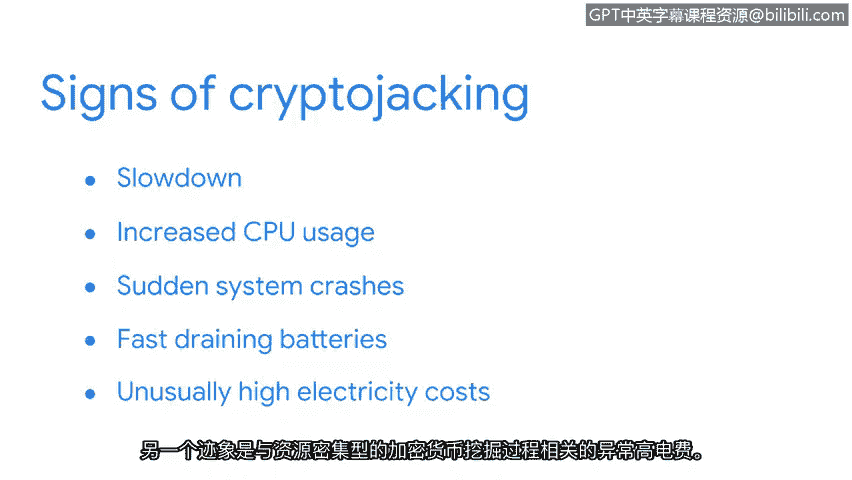

# 037：加密货币挖矿的崛起

在本节课程中，我们将探讨恶意软件的一种现代演变形式——加密货币劫持。我们将了解其工作原理、如何识别其迹象，以及可以采取哪些主动措施来防御此类攻击。

恶意软件几乎与计算机本身一样古老。在其早期形式中，它被麻烦制造者用作一种数字破坏手段。在当今的数字世界中，恶意软件已成为一种有利可图的犯罪形式，攻击者利用它来获取经济利益。作为一名安全专业人员，了解恶意软件的最新演变至关重要。

让我们更深入地了解恶意软件演变的一种方式。然后，我们将以此为例，思考如何发现恶意软件以及如何主动防御它。

勒索软件是攻击者用来窃取金钱的恶意软件类型之一。另一种较新的恶意软件类型是加密货币劫持。

## 什么是加密货币劫持？

加密货币劫持是一种恶意软件形式，它通过安装软件来非法挖掘加密货币。你可能从新闻中听说过加密货币。如果你对这个话题不熟悉，加密货币是一种具有现实世界价值的数字货币，就像实物货币一样。它有许多不同类型，通常被称为“币”或“代币”。

简单来说，加密货币挖矿是获取新币的过程。加密货币挖矿类似于挖掘黄金等其他资源的过程。挖掘黄金需要卡车和推土机等能挖掘土地的机械设备。而挖掘加密货币则使用计算机。计算机运行软件来“挖掘”数十亿行加密代码，而不是挖掘土地。当处理了足够多的代码时，就可能“找到”一个加密货币币。

一般来说，参与挖矿的计算机越多，就能发现越多的加密货币。不幸的是，犯罪分子在2017年左右意识到了这一点。加密货币劫持恶意软件开始被用来未经授权地控制个人计算机以挖掘加密货币。

## 加密货币劫持的演变与传播

自那时起，加密货币劫持技术变得更加复杂。犯罪分子现在经常针对存在漏洞的服务器来传播他们的挖矿软件。与受感染服务器通信的设备自身也会被感染。然后，恶意代码在后台运行，在无人知晓的情况下挖掘加密货币。

加密货币劫持软件很难被检测到。幸运的是，安全专业人员拥有可以协助的复杂工具。入侵检测系统（IDS）是一种监控系统活动并对可能的入侵发出警报的应用程序。当检测到异常活动（如恶意软件挖掘加密货币）时，IDS会向安全人员发出警报。

尽管检测系统很有用，但它们有一个主要缺点：新形式的恶意软件可能无法被检测到。

## 如何识别设备感染

幸运的是，有一些细微的迹象可以表明设备感染了加密货币劫持软件或其他形式的恶意软件。

迄今为止，加密货币劫持感染最明显的迹象是**系统运行速度变慢**。

以下是其他一些可能的迹象：

*   **CPU使用率增加**：设备处理器持续高负荷运行。
*   **系统突然崩溃**：设备无预警地频繁死机或重启。
*   **电池电量快速耗尽**：移动设备的电池消耗速度异常快。
*   **电费异常高**：这与加密货币挖矿这一资源密集型过程有关。

## 主动防御措施

了解可以采取哪些措施来降低遭遇加密货币劫持等恶意软件攻击的可能性也很重要。

这些防御措施包括：

*   **使用旨在拦截恶意软件的浏览器扩展程序**。
*   **使用广告拦截器**。
*   **禁用JavaScript**（在安全要求高的场景下）。
*   **随时关注最新的安全趋势和威胁**。

安全分析师还可以教育组织内的其他人防范恶意软件攻击。

## 总结

虽然加密货币劫持仍然相对较新，但它正变得越来越普遍。网络犯罪分子传播的恶意代码类型在不断演变。分析新形式的恶意软件需要多年的经验。尽管如此，你已经走在帮助防御这些威胁的正确道路上了。

