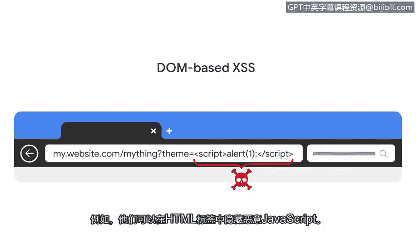

**谷歌网络安全专业证书：第五课：资产、威胁和漏洞**

**P38：跨站脚本（XSS）**

在本节课程中，我们将学习一种基于网络的常见威胁：跨站脚本攻击。我们将了解其工作原理、主要类型以及它如何被用来窃取敏感信息。

---

### **概述：基于网络的攻击**

上一节我们探讨了几种恶意软件。无论是安装在个人电脑还是网络服务器上，所有恶意软件都需要先被投递到目标系统才能发挥作用。网络钓鱼和其他社会工程学技术是恶意软件常见的投递方式。

另一种传播方式是利用一类广泛的威胁，即**基于网络的漏洞利用**。

基于网络的漏洞利用是指利用恶意代码或行为，来利用Web应用程序中的编码缺陷。网络罪犯利用基于网络的漏洞利用来获取敏感个人信息。这些攻击之所以发生，是因为Web应用程序在跨多个网络与多个用户交互时存在弱点。

恶意黑客通常利用这种高水平的交互性发起**注入攻击**。

---

### **什么是注入攻击？**

注入攻击是指将恶意代码插入到存在漏洞的应用程序中。被感染的应用程序通常看起来运行正常，这是因为注入的代码在后台运行，用户并不知情。

应用程序容易受到注入攻击，是因为它们被设计为接收数据输入。这可能是用户键入、点击的内容，或是一个程序与另一个程序共享的数据。

当编码正确时，应用程序应该能够解释和处理用户输入。例如，一个应用程序期望用户输入电话号码。该应用程序应验证用户的输入，确保数据全是数字且不超过10位。如果用户的输入不符合这些要求，应用程序应知道如何处理。

然而，Web应用程序与多个用户、跨多个平台交互，并且包含许多交互对象，如图像和按钮。这使得开发人员很难考虑到所有需要清理输入的方式。

---

### **跨站脚本攻击简介**

一种常见且危险的、威胁Web应用程序的注入攻击类型是**跨站脚本**。

**跨站脚本**或**XSS**是一种将代码插入到存在漏洞的网站或Web应用程序中的注入攻击。这些攻击通常通过利用大多数网站使用的两种语言来实施：**HTML**和**JavaScript**。这两种语言都能让网络罪犯访问受感染网页上加载的所有内容，包括会话Cookie、地理位置，甚至网络摄像头和麦克风。

跨站脚本攻击主要有三种类型：反射型、存储型和基于DOM型。

---

### **反射型XSS攻击**

**反射型XSS攻击**是指恶意脚本被发送到服务器，并在服务器响应期间被激活的情况。一个常见的例子是网站的搜索栏。

以下是反射型XSS攻击的典型过程：
1.  攻击者向目标发送一个看似指向可信站点的网页链接。
2.  当目标点击链接时，会向存在漏洞的网站服务器发送一个HTTP请求。
3.  攻击者的脚本随后被“反射”回无辜用户的浏览器。
4.  浏览器因为信任服务器的响应而加载了恶意脚本。
5.  脚本加载后，会话Cookie等信息就会被发送回攻击者。

---

### **存储型XSS攻击**

在**存储型XSS攻击**中，恶意脚本并非隐藏在需要发送给服务器的链接里。相反，存储型XSS攻击是指恶意脚本被直接注入到服务器上的情况。

在这种攻击中，攻击者目标是网站中提供给用户的元素，例如访问网站时加载的图像和按钮。当用户仅仅访问该网站时，受感染的元素就会激活恶意代码。

存储型XSS攻击可能造成严重破坏，因为用户事先无法知道网站已被感染。

---

### **基于DOM的XSS攻击**

最后一种是**基于DOM的XSS攻击**。DOM代表**文档对象模型**，基本上是网站的源代码。

基于DOM的XSS攻击是指恶意脚本存在于网页浏览器加载的内容中的情况。与反射型XSS不同，这类攻击不需要发送到服务器即可激活。

在基于DOM的攻击中，恶意脚本可以在URL中看到。例如，网站的URL包含参数值，这些参数值反映了用户的输入。假设一个网站允许用户选择颜色主题，当用户做出选择时，它会作为URL的一部分出现。在基于DOM的攻击中，罪犯会修改那些接受输入的参数。例如，他们可以将恶意JavaScript代码隐藏在HTML标签中，浏览器会处理HTML并执行JavaScript。

---

### **总结**

黑客利用这些跨站脚本方法来窃取敏感信息。安全分析师需要熟悉这类注入攻击。然而，它们并非唯一的攻击类型，我们将在后续课程中继续探索。

本节课我们一起学习了跨站脚本攻击，了解了其作为注入攻击的本质，并详细分析了反射型、存储型和基于DOM型这三种主要攻击方式的工作原理。

