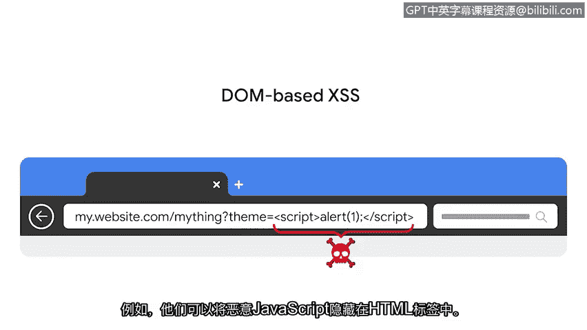

# 039：跨站脚本攻击 (XSS) 🔐

在本节课中，我们将要学习一种常见的网络攻击类型——跨站脚本攻击。我们将了解其工作原理、主要类型以及它如何对网络应用构成威胁。

## 概述

上一节我们探讨了几种恶意软件。无论是安装在个人电脑还是网络服务器上，所有恶意软件都需要在生效前被投递到目标。网络钓鱼和其他社会工程学技术是恶意软件常见的投递方式。

另一种传播方式是利用一类广泛的威胁，即基于网络的漏洞利用。

## 基于网络的漏洞利用

基于网络的漏洞利用是指用于利用网络应用程序中编码缺陷的恶意代码或行为。网络罪犯利用基于网络的漏洞来获取敏感的个人信息。这些攻击之所以发生，是因为网络应用程序在多个用户跨越多个网络时进行交互。

恶意黑客通常利用这种高水平的交互性发起注入攻击。

## 注入攻击

注入攻击是指将恶意代码插入到存在漏洞的应用程序中。被感染的应用程序通常看起来运行正常。这是因为注入的代码在后台运行，用户并不知情。

应用程序之所以容易受到注入攻击，是因为它们被编程为接收数据输入。这可能是用户键入、点击的内容，或者是一个程序与另一个程序共享的内容。

当编码正确时，应用程序应该能够解释和处理用户输入。例如，一个应用程序期望用户输入一个电话号码。该应用程序应验证用户的输入，以确保数据全是数字且不超过10位。如果用户的输入不符合这些要求，应用程序应知道如何处理。

网络应用与多个用户跨多个平台交互。它们还包含许多交互对象，如图像和按钮。这使得开发人员很难考虑到所有需要清理输入的方式。

## 跨站脚本攻击 (XSS)

一种常见且危险的、对网络应用构成威胁的注入攻击是跨站脚本攻击。

跨站脚本攻击，简称 **XSS**，是一种将代码插入到存在漏洞的网站或网络应用程序中的注入攻击。这些攻击通常通过利用大多数网站使用的两种语言来实施：**HTML** 和 **JavaScript**。这两种语言都能让网络罪犯访问受感染网页上加载的所有内容，包括会话Cookie、地理位置，甚至网络摄像头和麦克风。

跨站脚本攻击主要有三种类型：反射型、存储型和基于DOM型。

### 反射型 XSS 攻击

反射型 XSS 攻击是指恶意脚本被发送到服务器，并在服务器响应期间被激活的情况。一个常见的例子是网站的搜索栏。

以下是反射型 XSS 攻击的典型过程：
1.  攻击者向目标发送一个看似指向可信网站的链接。
2.  当目标点击链接时，会向存在漏洞的网站服务器发送一个 HTTP 请求。
3.  攻击者的脚本随后被返回或“反射”回无辜用户的浏览器。
4.  浏览器加载恶意脚本，因为它信任服务器的响应。
5.  脚本加载后，会话Cookie等信息就会被发送回攻击者。

### 存储型 XSS 攻击

在存储型 XSS 攻击中，恶意脚本并非隐藏在需要发送到服务器的链接里。相反，存储型 XSS 攻击是指恶意脚本被直接注入到服务器上的情况。

在这种攻击中，攻击者瞄准网站中提供给用户的元素。这可能是用户访问网站时加载的图像和按钮等。当用户仅仅访问网站时，受感染的元素就会激活恶意代码。

存储型 XSS 攻击可能造成严重破坏，因为用户无法事先知道网站已被感染。

### 基于 DOM 的 XSS 攻击

最后一种是基于 DOM 的 XSS 攻击。DOM 代表文档对象模型，基本上是网站的源代码。基于 DOM 的 XSS 攻击是指恶意脚本存在于网页浏览器加载时的情况。

与反射型 XSS 不同，这些攻击不需要发送到服务器即可激活。

在基于 DOM 的攻击中，恶意脚本可以在 URL 中看到。例如，网站的 URL 包含参数值。这些参数值反映了用户的输入。假设一个网站允许用户选择颜色主题。当用户做出选择时，它会作为 URL 的一部分出现。

在基于 DOM 的攻击中，罪犯会更改代表输入的参数。例如，他们可以将恶意 JavaScript 隐藏在 HTML 标签中。浏览器会处理 HTML 并执行 JavaScript。

## 总结

本节课中，我们一起学习了跨站脚本攻击。我们了解到，黑客利用这些跨站脚本方法来窃取敏感信息。安全分析师应该熟悉这类注入攻击。然而，它们并非唯一的攻击类型，我们将在下次课程中继续探索。