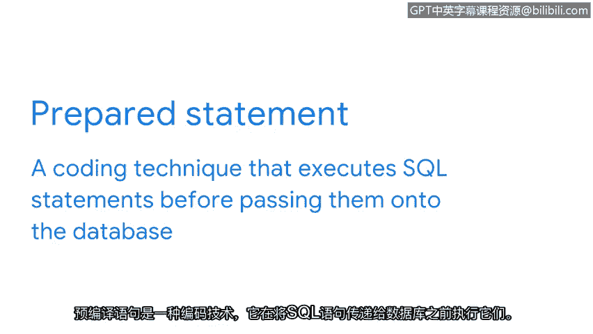

# 040：数据库中的可利用漏洞


在本节中，我们将继续探讨注入攻击，并研究另一种常见的基于网络的漏洞利用方式。我们将重点讨论网站如何从数据库访问信息，以及攻击者如何利用这一过程。

上一节我们介绍了跨站脚本攻击，本节中我们来看看另一种常见的注入攻击：SQL注入。这种攻击针对的是网站与数据库交互的方式。

## 数据库与SQL语言

在课程早期，你可能已经学习过SQL。SQL是一种用于创建、与数据库交互以及从数据库请求信息的编程语言。大多数网络应用程序都使用SQL，例如购物网站就大量使用它。

想象一下一家在线服装店的数据库，它很可能包含了公司销售的所有商品的完整库存信息。

网站通常不会让用户手动输入SQL查询语句。相反，它们使用菜单、图片和按钮等元素，以有意义的方式向用户展示信息。

例如，当在线购物者点击按钮将一件毛衣加入购物车时，就会触发一个SQL查询。这个查询在后台运行，用户是看不到的。

## SQL注入攻击原理

虽然用户在使用网站的菜单和按钮时无从察觉，但有时这些后台查询容易受到注入攻击。

SQL注入是一种在数据库上执行意外查询的攻击。与跨站脚本攻击类似，SQL注入的发生也是由于缺乏对输入的净化处理。

注入通常发生在网站设计用于接受用户输入的区域，一个常见的例子是网站的登录表单。

当用户输入其凭据时，此类表单可能会触发类似以下的后端SQL语句：

```sql
SELECT * FROM users WHERE username = ‘[user_input]’ AND password = ‘[user_input]’;
```

像这样的网络表单被设计成将用户输入完全按照其书写方式复制到SQL语句中。然后，该语句向服务器发送请求，服务器执行查询。

容易受到SQL注入攻击的网站在运行代码之前，会完全按照输入的原样插入用户输入。不幸的是，这是一个严重的设计缺陷。这种情况通常发生，因为网络开发人员期望人们正确使用输入，而没有预见到攻击者会利用它们。

## 攻击后果与防御

例如，攻击者可能会插入额外的SQL代码。这可能导致服务器运行一段未经检查的有害查询代码。

恶意黑客可以针对这些攻击向量来获取敏感信息、修改数据表，甚至获得数据库的管理员权限。

防御SQL注入的最佳方法是编写能够净化输入的代码。开发人员编写代码来搜索特定的SQL字符，这使服务器更清楚地了解应期待何种输入。

以下是实现输入净化的一种主要方法：



**使用预编译语句**

预编译语句是一种编码技术，它在将SQL语句传递到数据库之前先执行它们。


当用户输入未知时，最佳实践是使用这些预编译语句。只需添加几行额外的代码，预编译语句就能在将代码传递到服务器之前执行它。这意味着可以在执行查询之前验证代码。

拥有编写良好的代码是防止SQL注入的关键之一。安全团队与程序开发人员合作，测试应用程序是否存在此类漏洞。与许多安全任务一样，这是一项团队工作。

## 总结

本节课中我们一起学习了SQL注入攻击。注入攻击只是安全团队需要处理的众多基于网络的漏洞利用类型之一。接下来，我们将探讨安全团队如何为注入攻击和其他类型的威胁做好准备。