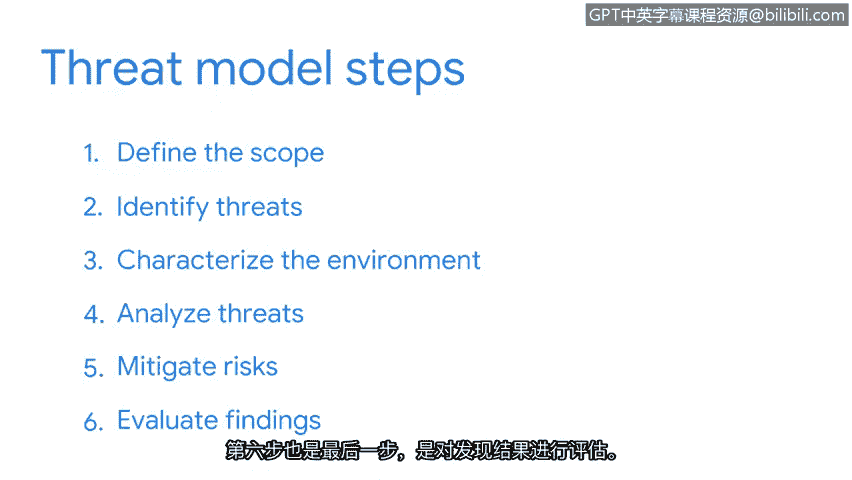

# 041：积极的安全方法

在本节课中，我们将学习如何通过一种称为“威胁建模”的积极方法来为潜在的网络攻击做准备。我们将了解威胁建模的六个核心步骤，以及安全团队如何利用这一过程来识别风险并制定防御策略。

## 概述：积极防御的重要性 🛡️

为攻击做好准备是整个安全团队的一项重要职责。威胁行为者拥有多种工具，其具体选择取决于攻击目标。例如，攻击一家小型企业与攻击一家公共事业公司的方式可能截然不同，因为两者拥有不同的资产和特定的防御措施。

在所有情况下，预测攻击都是做好应对准备的关键。在安全领域，我们通过执行一项称为“威胁建模”的活动来实现这一目标。

## 什么是威胁建模？ 🔍

威胁建模是一个识别资产、其漏洞以及每个资产如何暴露于威胁之下的过程。我们将威胁建模应用于所有需要保护的对象，包括整个系统、应用程序或业务流程，都会从这种安全相关的视角进行审视。

创建威胁模型是一项冗长而详细的活动，通常由一群在该领域拥有多年经验的个人共同完成。因此，它被认为是网络安全中的一项高级技能。但这并不意味着您不会参与其中。

## 威胁建模的六个步骤 📝

安全领域使用了多种威胁建模框架，有些更适合网络安全，有些则更适合信息安全或应用程序开发。总的来说，威胁建模包含以下六个步骤。

以下是威胁建模过程的详细步骤：

1.  **定义模型范围**
    在此阶段，团队通过创建资产清单并对其进行分类，来确定他们要构建或保护的对象。

2.  **识别威胁**
    在此步骤中，团队定义所有潜在的威胁行为者。威胁行为者是指任何构成安全风险的个人或团体。威胁行为者可分为内部和外部两类。例如，内部威胁行为者可能是一名故意损害资产的员工；外部威胁行为者可能是一名恶意黑客或商业竞争对手。

3.  **构建攻击树**
    在识别威胁行为者之后，团队会构建所谓的“攻击树”。攻击树是一种将威胁映射到资产的图表。团队在构建此图表时会尽可能详细。

4.  **分析环境**
    在此步骤中，团队将攻击者思维应用于业务环境。他们会考虑客户和员工如何与环境互动，同时也会考虑外部合作伙伴和第三方供应商等因素。

5.  **分析威胁**
    团队在此步骤中共同检查现有的保护措施，并识别其中的差距。然后，他们根据自己分配的风险评分对威胁进行排序。

6.  **决定风险缓解措施**
    此时，团队制定防御威胁的计划。可选择的策略包括：规避风险、转移风险、降低风险或接受风险。

7.  **评估结果**
    在此最后阶段，记录整个演练过程中的所有工作，应用修复措施，并记录取得的任何成功。团队还会记录所学的经验教训，以便为未来的威胁建模工作提供参考。

## 总结与回顾 📚

以上概述了通用的威胁建模过程。我们所探讨的只是众多现有方法中的一种。

本节课中，我们一起学习了积极安全方法的核心——威胁建模。我们了解到，威胁建模是一个系统化的六步过程，从定义范围开始，到评估结果结束。通过这个过程，安全团队可以主动识别资产面临的威胁和漏洞，并提前规划防御策略，从而更有效地保护组织免受攻击。掌握这一框架是构建强大安全态势的基础。