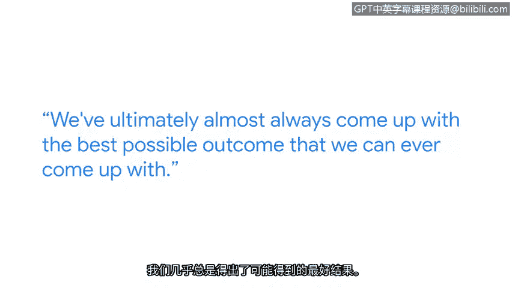

# 042：网络安全中多样性的价值

在本节课中，我们将跟随谷歌安全工程师香特尔的分享，探讨多样性在网络安全领域的重要价值。我们将了解多样化的团队如何激发创意、提升问题解决能力，并获取进入网络安全行业的实用建议。

## 个人背景与职业道路

我的名字是香特尔，我是谷歌的一名安全工程师，隶属于安全实施与扩展团队。我们的职责是保护和监控包含敏感信息的系统。

我的职业道路并非从一开始就规划好的。最初，我的目标是成为一名心脏外科医生。然而，在学习了化学课程之后，我改变了主意。我对网络安全的兴趣源于一部名为《黑客军团》的电视剧。这部剧讲述了一位试图拯救世界的黑客义警的故事，它激发了我对安全领域的兴趣，并为我奠定了良好的基础。

## 多样性的核心价值

上一节我们了解了香特尔的入行经历，本节中我们来看看她如何看待团队多样性。在网络安全领域，重视多样性至关重要，因为它使我们能够接触到广泛的思维方式。这有助于激发许多创造性的想法，带来不同的视角和解决问题的方法。这种多样性推动我们成为更优秀的安全工程师。

我们的经理劳伦经常会提醒我们：不要急于寻找解决方案，不要急于独自解决问题。我们拥有广泛的安全工程师资源和人际网络可供利用。她鼓励我们走出去寻求这些资源，然后回来集合，头脑风暴我们收集到的所有想法。在尝试寻找答案之后，我们几乎总能得出可能的最佳结果。

## 给新人的行业建议

了解了多样性的力量后，你可能会想如何进入这个行业。以下是给希望进入网络安全行业的人的建议：积极主动地行动起来。

我强烈建议尝试 **Hack The Box** 或 **TryHackMe** 这类实战平台。我也非常推荐加入推特上的安全社区。目前推特上有一个庞大的安全社区，分享大量资源、机会和职位信息，并且非常乐意与任何有兴趣进入这个领域但不知从何开始的人交流。

## 总结与职业推荐

本节课中我们一起学习了网络安全中多样性的重要性。我推荐将网络安全作为职业选择。就我个人而言，我发现在安全领域能够充分展现我“叛逆”的一面。我发现自己能在安全工作中更充分地表达自我。这真是一个充满魅力的领域。

