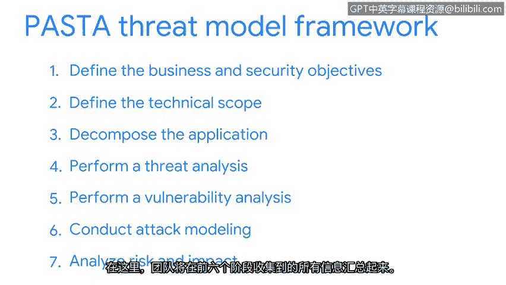

# 043：攻击模拟和威胁分析的过程

在本节课中，我们将通过一个真实场景来完整探索威胁建模。我们将使用一个名为PASTA的标准威胁建模过程。

想象一家健身公司正准备推出其首款移动应用。😊。在上线之前，公司要求其安全团队确保该应用能够保护客户数据。团队决定使用PASTA框架进行威胁建模。

PASTA是一个在许多行业广泛使用的流行威胁建模框架。PASTA是“攻击模拟和威胁分析过程”的缩写。

PASTA框架包含七个阶段。让我们逐一了解，以帮助这家健身公司准备好他们的应用。

## 阶段1：定义业务和安全目标

PASTA威胁建模框架的第一阶段是定义业务和安全目标。在开始威胁建模之前，团队需要确定他们的目标是什么。

在我们健身公司应用的例子中，主要目标是保护客户数据。团队在此阶段首先会提出大量问题。他们需要了解诸如个人身份信息是如何处理的这类事情。回答这些问题对于评估后续发现的威胁影响至关重要。

## 阶段2：定义技术范围

接下来是PASTA框架的第二阶段：定义技术范围。在此阶段，团队的重点是识别必须进行评估的应用程序组件。这就是我们之前讨论过的攻击面。

对于一个移动应用，这包括数据处于风险和使用状态时所涉及的技术。这包括网络协议、安全控制和其他数据交互。

## 阶段3：分解应用程序

在PASTA的第三阶段，团队的工作是分解应用程序。换句话说，我们需要识别现有的、能够保护用户数据免受威胁的控制措施。

这通常意味着需要与应用程序开发人员合作，制作一个数据流图。这样的图表会展示数据如何从用户设备传输到公司数据库，并识别在此过程中保护这些数据的控制措施。

## 阶段4：执行威胁分析

接下来是PASTA的第四阶段。此阶段的重点是执行威胁分析。在这里，团队需要进入攻击者的思维模式。

团队会进行研究，收集关于当前正在使用的攻击类型的最新信息。与其他技术一样，移动应用存在许多攻击向量。这些向量会定期变化，因此团队需要参考资源以保持信息更新。

## 阶段5：执行漏洞分析

PASTA的第五阶段是执行漏洞分析。在此阶段，团队通过考虑问题的根源，更深入地调查潜在的漏洞。

## 阶段6：进行攻击建模

接下来是第六阶段，团队在此进行攻击建模。这是团队通过模拟攻击来测试在第五阶段分析的漏洞的地方。

团队通过创建一个攻击树来完成这项工作，攻击树看起来像一个流程图。例如，我们移动应用的攻击树可能如下所示：

以下是攻击树的一个分支示例：
*   **目标**：用户名和密码等客户信息。
*   **存储位置**：这些数据通常存储在数据库中。
*   **已知漏洞**：我们知道数据库容易受到SQL注入等攻击。
*   **攻击向量**：因此，我们将此攻击向量添加到攻击树中。
*   **利用方式**：威胁行为者可能利用未净化的输入导致的漏洞来攻击此向量。

安全团队使用这样的攻击树来识别需要测试以验证威胁的攻击向量。这只是该攻击树的一个分支。像健身应用这样的应用程序通常有许多分支，包含大量其他攻击向量。

## 阶段7：分析风险和影响

PASTA的第七阶段是分析风险和影响。在此阶段，团队汇总他们在第1至第6阶段收集的所有信息。

到了这个阶段，团队已经能够根据业务目标，向利益相关者提出明智的风险管理建议。

就这样，我们基于PASTA框架完成了一次完整的威胁建模练习。😊。

## 总结

本节课中，我们一起学习了PASTA威胁建模框架的七个阶段。我们从一个健身公司移动应用的场景出发，了解了从定义目标、分析技术范围、分解应用、进行威胁和漏洞分析，到最终建模攻击并评估风险的全过程。这个过程帮助安全团队系统地识别和应对潜在威胁，确保应用程序在上线前具备足够的安全防护。