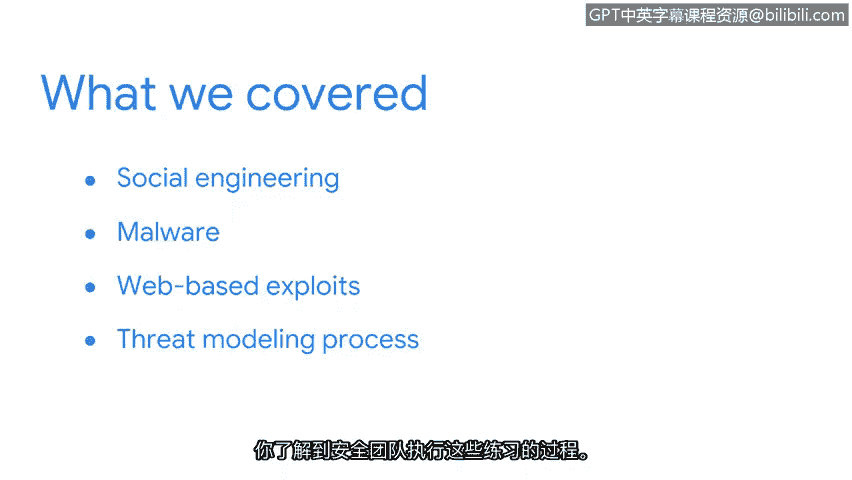

# 044：总结

在本节课中，我们学习了网络安全专业人员日常工作中的核心部分——威胁管理。我们探讨了在安全领域中可能遇到的几种常见网络威胁类型。

## 🧠 回顾核心威胁类型

上一节我们介绍了威胁管理的整体框架，本节中我们来回顾一下讨论过的具体威胁类型。

以下是我们在本部分课程中探讨的主要威胁类别：

*   **社会工程学**：攻击者利用多种方法欺骗目标，使其泄露私人信息。这些技术依赖于利用人们的信任和乐于助人的心理。**钓鱼攻击**是攻击者操纵目标最常见的手段之一。
*   **恶意软件**：我们讨论了恶意软件的主要类别，例如**病毒**、**木马**和**蠕虫**。你学习了如何识别系统感染的迹象，也了解了恶意软件如何随着时间演变并变得更加复杂。
*   **基于网络的攻击**：我们将注意力转向了基于网络的漏洞利用，特别是**注入攻击**。你了解了**跨站脚本攻击**和**SQL注入攻击**，这是组织在线面临的最常见的两种攻击类型。我们讨论了这些攻击是如何实施的，你也学习了如何保护Web应用程序免受恶意代码的侵害。
*   **威胁建模**：最后，我们探索了威胁建模的过程。你学习了安全团队用来执行这些分析练习的流程。

## 💡 威胁认知的重要性

不幸的是，网络攻击和安全漏洞是我们必须定期面对的挑战。

然而，了解存在的威胁类型以及掌握威胁建模过程，为你作为一名安全分析师的工作奠定了重要的基础。这使你能够更主动地识别、评估和应对潜在风险。

## 🎯 总结

本节课中，我们一起学习了网络安全中的核心威胁类型及其管理基础。我们从利用人性弱点的社会工程学，到破坏系统的各类恶意软件，再到针对Web应用的注入攻击，最后了解了系统化分析风险的威胁建模过程。这些知识构成了你理解和应对现实世界网络威胁的坚实基础。