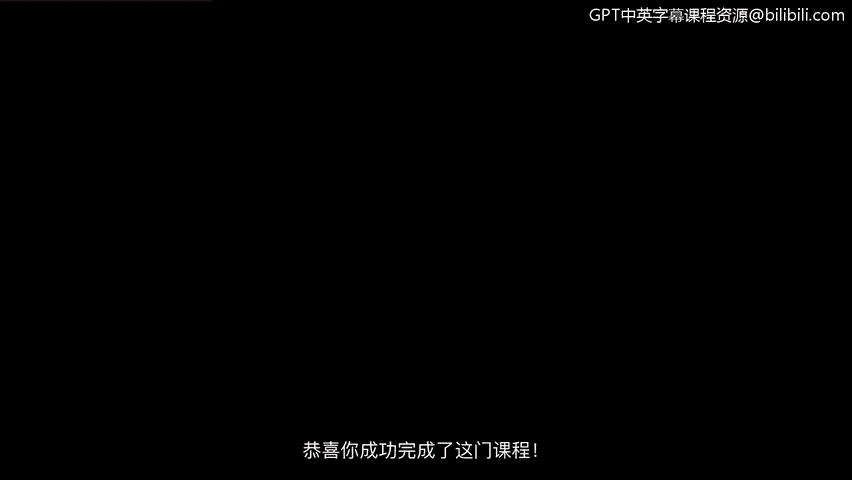
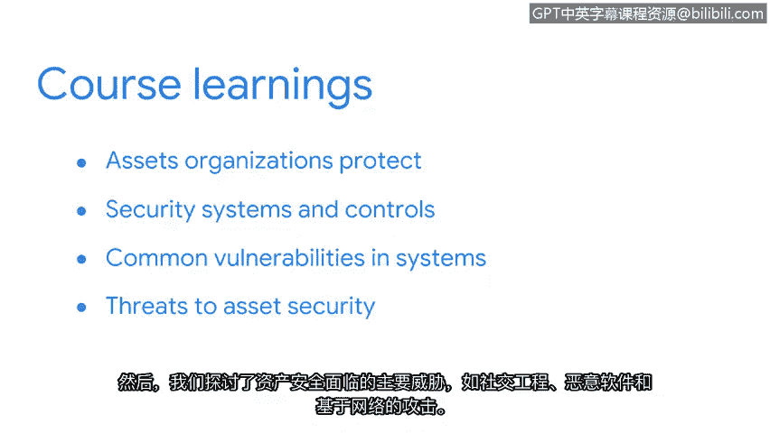

# 045：课程总结 🎯

在本节课中，我们将回顾并总结《资产、威胁和漏洞》课程的核心内容与学习成果。

恭喜你成功完成了本课程的学习。😊

很难相信我们的共同学习时光即将结束。在继续证书项目的后续课程之前，我喜欢回顾你所取得的惊人进步。

## 课程内容回顾

当我们开始时，课程介绍了组织需要保护的广泛资产。我们的主要焦点是信息安全，特别是数字信息。😊

以下是本课程涵盖的核心模块：

**资产分类与风险管理**
*   你学习了资产分类如何帮助安全团队集中精力并优先分配资源。
*   我们探讨了数据的三种状态下的数字资产。
*   我们还学习了政策、标准和程序如何减轻组织风险。
*   对NIS网络安全框架的关注，向你介绍了一个常用的风险管理框架。

**安全系统与控制**
上一节我们介绍了风险管理框架，本节中我们来看看具体的安全防护措施。

*   你探索了像加密这样的技术，它用于保护各种状态下的数据。
*   你还学习了公钥基础设施和数字证书等技术如何用于维护在线信息的机密性、完整性和可用性。
*   此外，你探索了构成认证、授权和记账框架的访问控制。

**漏洞与防御**
接下来，我们探讨了常见的漏洞和系统。在课程的这一部分，你深入了解了安全团队如何在攻击发生前进行布防。

*   我们探讨了用于保护在线各方之间信息交换的纵深防御策略。
*   你了解了常见漏洞与暴露列表、漏洞评估流程以及攻击面和攻击向量。

**主要威胁**
然后，我们探讨了对资产安全的主要威胁，例如社会工程学、恶意软件和基于网络的攻击。我们一起讨论了这些攻击是如何实施的，以及安全团队如何防止它们造成损害。

**威胁建模**
最后，我们以探索威胁建模流程作为结束。我们涵盖的内容非常多，我衷心感谢你为此付出的所有努力。

## 展望未来 🚀

当我刚开始我的安全职业生涯时，我的目标是学习、建立人脉并抓住任何机会。我得以参加安全会议、获得工作建议、赢得推荐信，并通过志愿服务积累经验。😊

那时，我从未想象过我会在这里将我学到的东西传授给他人。这恰恰说明，你的安全之旅才刚刚开始。

虽然我们的共同学习时光结束了，但我们涵盖了许多复杂的主题，其中很多是安全领域的专业方向。凭借你在这里打下的基础，你拥有广泛的可能性，可以继续在这个领域成长。

我很高兴能在你步入安全世界的这一步中扮演一个角色，并祝愿你在前进的道路上一切顺利。😊

## 总结

本节课中我们一起回顾了《资产、威胁和漏洞》课程的全部核心内容，从资产分类、安全控制到漏洞、威胁分析与建模。你已建立起坚实的安全基础知识，为后续的深入学习与实践开启了大门。