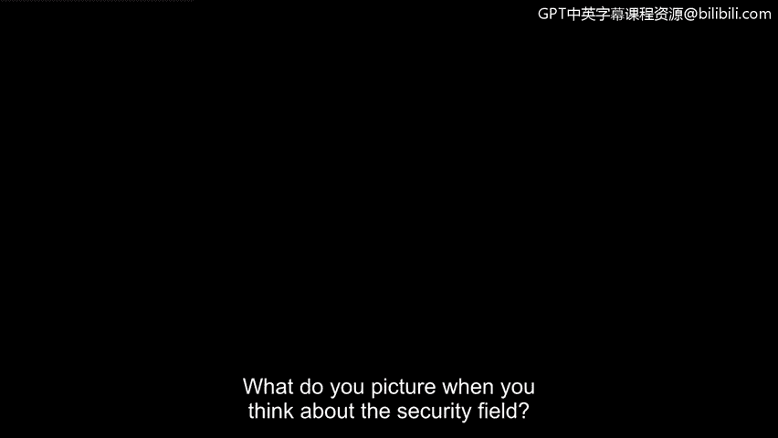
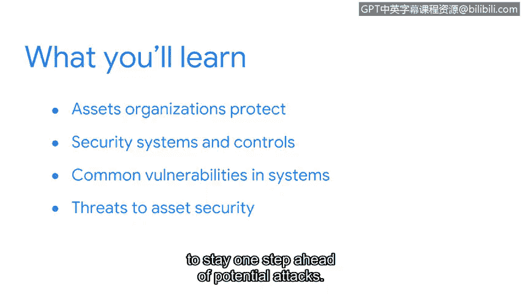

# 046：课程介绍

在本节课中，我们将学习网络安全的基础概念，包括资产、威胁和漏洞。我们将探讨安全团队如何通过人员、流程和技术的结合来保护重要资源。

---

当你想到安全领域时，脑海中会浮现什么画面？

你可能会想到一个昏暗的房间，人们伏在电脑前工作。

或许你会想象一个人在实验室里仔细分析证据。

或者，你可能联想到一名警卫在大楼前站岗守卫。

事实上，无论你想到什么，所有这些例子都是广阔安全世界的一部分。

大家好，我是Dequietia。我担任安全工程师已有四年。

我很高兴能担任本课程的讲师，并与大家分享我在谷歌的一些经验。

我所在的团队由背景各异、视角独特的安全专业人员组成。

例如，在我的岗位上，我负责保护Gmail的安全。

我日常工作的一部分包括开发新的安全功能，以及修复应用程序中的漏洞，以确保用户的电子邮件更安全。

我团队中的一些成员在大学毕业后便开始从事安全工作。

还有许多其他成员是在其他行业工作多年后转入这个领域的。

安全团队的形式和规模各不相同。团队中的每个成员都扮演着特定的角色。

尽管我们在团队中的具体职能不同，但我们都有一个共同的目标：保护有价值的资产免受损害。

实现这一使命需要人员、流程和工具的结合。在本课程中，你将详细了解这三者。

首先，你将进入资产安全的世界。

你将了解组织保护的各种资产，以及这些资产如何影响公司的整体安全策略。

接下来，你将开始探索安全团队用来主动保护人员及其信息的系统和控制措施。

所有系统都存在可以改进的弱点。当这些弱点被忽视或忽略时，它们可能导致严重的问题。

在本课程的这一部分，你将重点关注系统中的常见漏洞，以及安全团队如何领先于潜在问题。

最后，你将学习资产安全面临的威胁。

你还将了解安全团队用来领先于潜在攻击的威胁建模流程。

在这个领域，我们尽一切可能避免陷入被攻破的境地。

到本课程结束时，你将更清楚地了解人员、流程和技术如何协同工作，以保护所有重要事物。

在整个课程中，你还将了解到这个领域令人兴奋的职业机会。

安全确实是一个跨学科的领域。你的背景和视角本身就是一种资产。

无论你是应届大学毕业生，还是正在开启新的职业道路，安全领域都提供了广泛的可能性。

那么，你准备好了吗？准备好和我一起踏上这段旅程了吗？

---

本节课中，我们一起学习了网络安全的基本框架，包括资产、威胁和漏洞的核心概念。我们了解到，安全是人员、流程和技术共同作用的结果，并且这个领域为不同背景的人提供了丰富的职业机会。