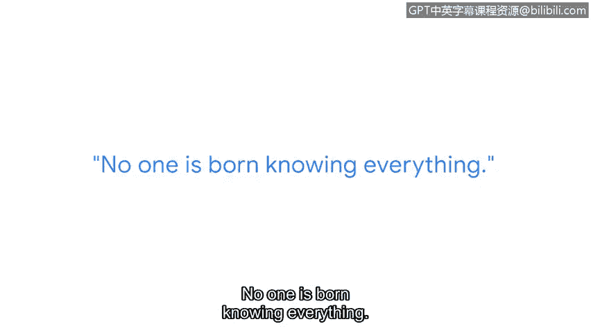

# 047：网络安全职业路径分享

在本节课程中，我们将跟随一位谷歌安全工程师的分享，了解她的职业发展路径、日常工作内容以及给初学者的建议。这有助于我们理解网络安全领域的实际工作场景和所需技能。

大家好，我的名字是Lucquitia，我是一名安全工程师。这基本上意味着我的工作是确保谷歌产品的安全性，从而保护像您这样的用户免受威胁。

在我进入网络安全领域之前，我从事过安装互联网的工作。我也在一家芯片工厂工作过，在快餐店工作过，还在商场卖过鞋。在来到这里之前，我做过很多事情。

我过去工作中学习的很多技能，实际上每天都在使用。其中一部分是我的软技能，例如时间管理、人际交往能力和沟通能力。

作为一名新的网络安全分析师，能够有效沟通、接受反馈并适应不适感非常重要。这种不适感并非来自你周围的人，而是来自你试图解决的问题，因为有时解决问题需要跳出固有思维模式并接受挑战。

我会把我的工作描述为谷歌的保安，因为我在Gmail安全团队工作，我的职责就是保护Gmail。一些威胁来自那些试图获取您的用户凭证或诱使您点击钓鱼链接的恶意邮件发送者。

至于漏洞，其中一些可能类似于未净化的输入，这可能导致麻烦。我的典型工作日和每个人一样开始。我查看电子邮件，然后进入我的漏洞队列。这本质上是当人们告诉我我们的某个产品存在问题时，我会开始做一些研究。

我喜欢进一步探索这个漏洞。我喜欢弄清楚如果这个漏洞能破坏这个，是否也能破坏那个。如果可以，我还能用它做什么。然后，我会寻找解决方案，以确保修复那个漏洞，以及我们安全体系中可能存在的任何其他漏洞。

您在本课程中学到的一些内容，例如威胁建模，是我每天都会用到的。每当我收到一个漏洞报告，我的部分工作就是理清攻击树，以及攻击者可能利用哪些类型的攻击向量来利用这些漏洞。

没有人是万事通。我知道这听起来很老套或非常明显，但它对我有帮助，因为它帮助我从他人的角度思考问题，理解每个人为了学习新事物所必须投入的时间和精力。

所以，对自己要有耐心。不要让任何人打击你进入网络安全领域的信心。参加这门课程是让你更接近目标的一步。现在不要气馁，继续前进。

在本节课中，我们一起学习了网络安全工程师的实际工作内容、所需技能以及职业发展建议。我们了解到，网络安全工作涉及保护资产、分析威胁和修复漏洞，而软技能和持续学习的态度与专业技术知识同等重要。