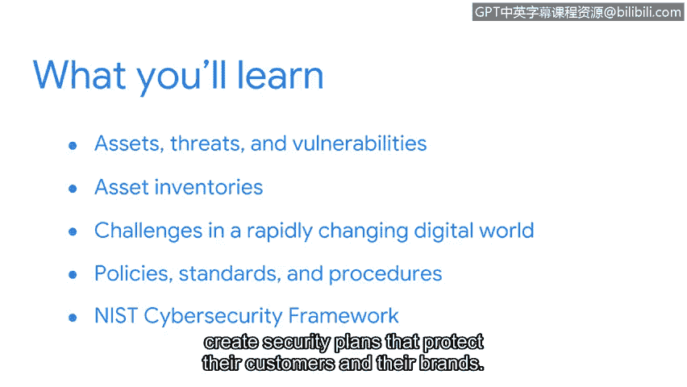

# 048：欢迎来到第一周 🚀

在本节课中，我们将要学习网络安全的基础构成要素：资产、威胁和漏洞。我们将探讨它们如何共同构成安全计划的核心，并了解组织如何利用资产清单等工具来保护其数字财产。课程最后，我们会介绍构建安全计划的基石——策略、标准和程序，并简要了解NIS网络安全框架。

---

如今，我们都非常依赖技术。这样的例子在我们身边随处可见。

个人设备，例如智能手机，帮助我们与全球的朋友和家人保持联系。

定位技术帮助我们实现个人目标并提高工作效率。

企业也在日常生活中接纳了技术，从简化运营到自动化流程。

因为技术，我们的世界联系更加紧密。😊

我们越依赖技术，我们分享的信息就越多。因此，每天都会产生海量的数据。

数据创造的巨大激增带来了独特的挑战。😊

随着企业越来越依赖技术，网络犯罪分子影响组织的手段也变得更加复杂。

由于企业存储着大量敏感数据，数据泄露正变得日益严重。

这些挑战带来的一个积极方面是，像你这样的人才需求正在增长。

安全是一项团队工作。像你这样的独特视角对任何组织来说都是一笔财富。

一个拥有多元背景、文化和经验的团队更有可能解决问题并实现创新。当数据泄露成为头条新闻时，很明显，组织需要更多专注于安全的专业人士。

😊，全球的公司都在努力跟上快速变化的数字环境的需求。随着环境持续转型，你的个人经验将愈发宝贵。

在本节中，我们将首先探讨资产、威胁和漏洞如何影响安全计划。之后，我们将讨论资产清单在保护公司各类资产方面的应用。

接着，我们会思考这个快速变化的数字世界所带来的挑战。最后，你将理解安全计划的构建模块：其策略、标准和程序。😊

我们将研究公司用来创建保护其客户和品牌的安全计划的NIS网络安全框架。

我希望你和我一样，对进入这个安全世界的旅程感到兴奋。现在，让我们开始吧。😊

---

本节课中我们一起学习了网络安全入门的关键概念。我们认识到技术依赖与数据增长带来的安全挑战，理解了资产、威胁和漏洞是安全分析的基础。我们还初步了解了组织如何通过资产清单和结构化框架（如NIS）来构建防御体系，为后续深入学习打下了基础。