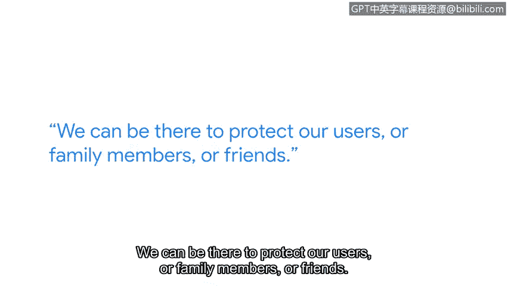

**谷歌网络安全专业证书课程：第五课：资产、威胁和漏洞**

**P50：4_04 资产安全中的职业生涯**

**概述**

在本节课程中，我们将跟随谷歌安全工程师Tree的视角，了解资产安全领域的日常工作内容、所需技能以及从业者的职业动力。你将了解到资产安全的核心职责，以及如何为应对网络威胁做好准备。

**日常工作与职责**

我是Tree，谷歌的一名安全工程师，隶属于检测与响应部门。

我的日常工作是什么样的呢？当然，公司提供免费的午餐和咖啡，这很不错。

我到达工位后，会打开安全信息与事件管理（SIEM）系统，查看有哪些值得关注的安全事件需要调查，以及存在哪些潜在的威胁需要分析。

此外，我的工作还包括改进我们的分析流程，以提升对潜在威胁的检测能力。

**职业起源与动力**

我对安全的热情始于年少时期。信不信由你，我曾是一次黑客攻击的受害者。

那时，我每天放学回家都会玩一款电脑游戏。有一天，我回到家启动游戏，屏幕上显示“您的CD密钥正在被使用”，后面跟着一个我不认识的奇怪名字。

起初我感到非常震惊。这款游戏是我自己购买的，竟然有人盗用了我的CD密钥。

但这次经历也激发了我开始学习如何保护自己的动力。例如，我学习了如何手动清除恶意软件，这后来成了我最喜欢的课题之一。同样出于兴趣，我开始对一些朋友进行一些“白帽”黑客活动。

**资产安全的重要性**

资产安全是一个非常重要的领域，你需要关注和保护多种多样的资产。

我最喜欢的部分是构建那些真正有潜力捕捉恶意行为的检测规则。

在资产管理安全中，你需要有能力准确地清点所有资产，这些资产包括IP地址、用户数据、员工设备等。并且要确保你的安全态势符合所需的标准。

**应对不断变化的威胁**

总有新的技术和硬件不断涌现。

我们的责任就是理解这些新技术可能带来的潜在新威胁。

**关键技能：解决问题与创造性思维**

解决问题能力和创造性思维在网络安全领域至关重要，因为这里总是存在复杂的问题。

人们需要能够跳出思维定式，创造性地、全面地思考，以找到降低风险的解决方案。

**职业的意义与责任**

网络安全是一项崇高的职业。互联网上可能发生很多事情，很多坏事。

但我们可以挺身而出，我们可以采取行动。我们可以在那里保护我们的用户、家人或朋友。

这份责任是沉重的，但当然，它也是一项非常重要的使命。我为自己是安全团队的一员而感到自豪。

**总结**

本节课中，我们一起了解了资产安全工程师的典型工作日常、职业发展路径以及这个角色所需的核心技能和思维模式。我们认识到，资产安全的核心在于**全面清点资产**并建立与之匹配的**安全防护措施**，同时需要具备**创造性解决问题的能力**以应对不断演变的威胁。这是一份充满挑战但也极具使命感和成就感的职业。