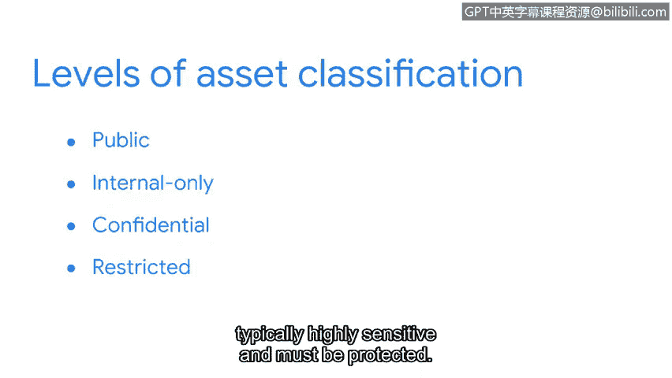

# 051：资产分类是安全起点 🔐

在本节课中，我们将要学习资产管理的基础，特别是资产清单和资产分类的重要性。我们将了解为什么组织需要清楚掌握其资产，以及如何根据资产的敏感性和重要性对其进行分类。

---

找不到重要的东西时，会让人感到非常有压力。

当你约会迟到却找不到钥匙时，就是如此。

我们所有人都会时不时地遇到类似的情况。

信不信由你，组织也会遇到同样的麻烦。

花几秒钟想一想你身边有多少重要资产。

例如，我想到的是我的手机、钱包和钥匙。

接下来，假设你刚刚加入一家小型在线零售商的安全团队。

这家公司在过去几年不断发展，客户越来越多。

因此，他们正在扩大安全部门，以保护日益增长的资产。

假设你们每个人负责10项资产。这是很多资产。

即使是在小型企业环境中。这也是数量惊人的需要保护的东西。

安全的一个基本事实是：你只能保护你已登记在册的东西。

**资产管理**是跟踪资产及其所受风险的过程。

所有的安全计划都围绕着资产管理展开。

回想一下，资产包括任何被认为对组织有价值的物品。

设备、数据和知识产权只是企业希望保护的众多资产中的几个。

每个组织安全计划的关键部分都是跟踪其资产。

资产管理始于拥有一份**资产清单**，即一份需要保护的资产目录。

这是保护组织资产的重要部分。

如果没有这份记录，组织就有可能失去对所有重要物品的跟踪。

理解资产清单的一个好方法是将其比作保护羊群的牧羊人。

准确统计羊的数量在很多方面都有帮助。

例如，可以更容易地分配食物等资源来照顾它们。

资产清单的另一个好处是，如果其中一项丢失，你会收到警报。

再次想一想你身边的重要资产。

就像我一样，你可能能够根据重要程度对它们进行评级。

例如，在安全方面，我会把我的钱包排在鞋子之前。

这种实践被称为**资产分类**。

总的来说，资产分类是根据资产对组织的敏感性和重要性对其进行标记的做法。

组织对资产的标记方式各不相同。许多组织遵循一个基本的分类方案：**公开**、**仅限内部**、**机密**和**受限**。

公开资产可以与任何人共享。仅限内部资产可以与组织内的任何人共享，但不应在组织外共享。

机密资产应仅由从事特定项目的人员访问。

被归类为受限的资产通常高度敏感，必须受到保护。

带有此标签的资产被视为“需要知道”。

例如包括知识产权以及健康或支付信息。

例如，一家发展中的在线零售商可能会将关于新产品的内部电子邮件标记为机密，因为从事该新产品的人员应该知道相关信息。

他们也可能在办公室的门上贴上“受限”标志，以阻止没有特定理由进入的任何人。

这些只是你可能从以往经验中熟悉的几个日常例子。

在很大程度上，分类决定了资产是否可以被披露、更改或销毁。

资产管理是一个持续的过程，有助于发现安全中潜在的、意想不到的漏洞。

跟踪对我们组织重要的一切是安全规划的重要组成部分。

---

本节课中，我们一起学习了资产管理的基础。我们了解到，安全始于对资产的清晰认识，而资产清单和资产分类是实现这一目标的关键工具。通过建立资产清单并根据敏感性和重要性对资产进行分类，组织能够更有效地分配资源、识别风险并保护其最有价值的资产。记住，你只能保护你已登记在册的东西。