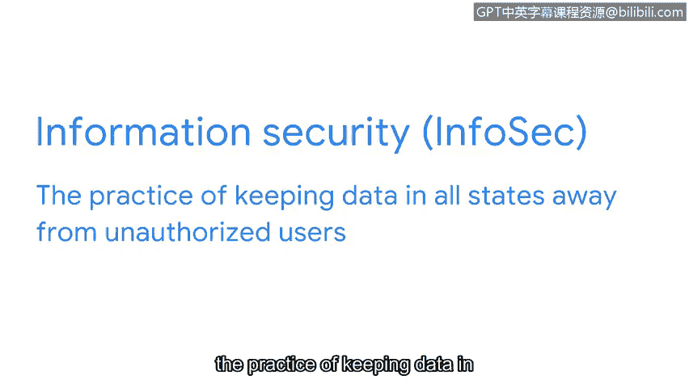

# 052：数字世界中的资产 🔒

在本节课中，我们将要学习数字世界中的资产，特别是数据的三种状态，以及信息安全团队如何根据数据的状态来实施保护。

欢迎回来。到目前为止，我们已经涵盖了大量信息。我们必须探讨组织资产是什么以及它们为何需要保护。你也已经对安全团队所保护的庞大资产量有了初步认识。此前，我们开始审视安全资产管理以及追踪对组织重要的一切事物的必要性。

安全团队根据价值对资产进行分类。接下来，让我们扩展安全思维，思考这个问题：一项资产的价值究竟体现在哪里？如今，答案通常是信息。大多数信息以数字形式存在。我们称之为数据。数据是由计算机翻译、处理或存储的信息。我们生活在一个互联的世界中，全球数十亿设备连接到互联网，并时刻相互交换数据。事实上，此刻就有数百万条数据正在传递到你的设备。

与实物资产相比，数字资产面临着额外的挑战。你需要理解的是，保护数据取决于数据所在的位置及其正在进行的活动。安全团队保护三种不同状态下的数据：使用中、传输中和静止中。让我们更详细地探讨这个概念。

以下是数据的三种状态：

*   **数据在使用中**：指正被一个或多个用户访问的数据。想象一下，你带着笔记本电脑在公园里。天气晴朗，你坐在长椅上查看电子邮件。这就是数据在使用中的一个例子。一旦你登录，你的收件箱就被视为处于使用状态。
*   **数据在传输中**：指从一个点传输到另一个点的数据。当你登录账户时，一位朋友发来一条消息。他们给你发送了一篇关于不断增长的安全行业的有趣文章。你决定回复，感谢他们发送这篇文章。当你点击发送时，这就成了数据在传输中的一个例子。
*   **数据在静止中**：指当前未被访问的数据。在这种状态下，数据通常存储在物理设备上。数据在静止中的一个例子是：当你检查完电子邮件并合上笔记本电脑后，决定收拾东西去附近的咖啡馆吃早餐。当你从公园走向咖啡馆时，你笔记本电脑中的数据就处于静止状态。

现在我们已经理解了数据的这些状态，让我们将其与资产管理联系起来。早些时候，我提到信息是公司可以拥有的最有价值的资产之一。

信息安全是保护所有状态下的数据免受未经授权用户访问的实践。信息安全薄弱是一个严重问题。它可能导致身份盗窃、财务损失和声誉损害等后果。这些事件有可能损害组织、其合作伙伴及其客户。

作为一名安全分析师，在你的工作中还有更多需要考虑的因素。随着我们的数字世界不断变化，我们也在调整对静止数据的理解。像智能手机这样的物理设备更普遍地将数据存储在云端，这意味着我们的信息并不一定因为手机放在桌子上就处于静止状态。随着我们的世界日益互联，我们应该始终警惕新的漏洞。

请记住，保护数据取决于数据的位置及其活动。追踪信息是公司在考虑其安全计划时需要解决的难题的一部分。理解数据的三种状态使安全团队能够分析风险，并为不同情况确定资产管理计划。

本节课中，我们一起学习了数字资产的核心——数据，并详细探讨了数据在使用中、传输中和静止中这三种状态。理解这些状态是制定有效信息安全策略和资产管理计划的基础。