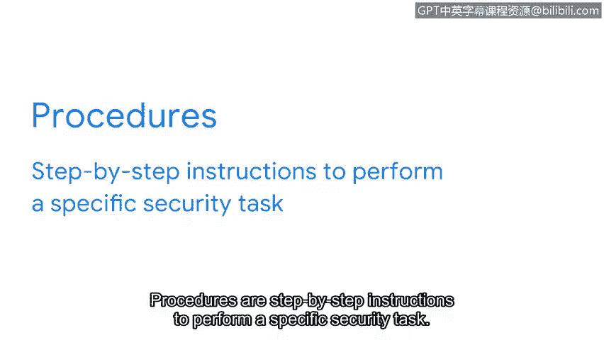

**谷歌网络安全专业证书：第五课：资产、威胁和漏洞**

**P53：7_01_elements-of-a-security-plan.en_subtitled**

**概述**

在本节课程中，我们将学习安全计划的核心构成要素。我们将了解安全不仅仅是技术问题，更是涉及人员、流程和技术的团队协作。我们将重点探讨安全计划如何通过具体的文档来指导组织应对风险。

**正文**

安全关乎人员、流程和技术。这是一项团队协作。

保护资产的责任远不止于一个人或IT部门的某个小组。事实上，安全是一种文化。它是一套贯穿组织各个层级的共同价值观。这些价值观影响着从员工到供应商再到客户的每一个人。

保护数字和物理资产需要每个人的参与，这可能是一个挑战。安全计划正是为此而设。计划形式多样，但它们都有一个共同目标：为风险发生做好准备。

将关注点放在人员身上，才能制定出最有效的安全计划。考虑到所有相关人员的不同背景和视角，确保在出现问题时没有人被遗漏。

我们之前讨论过，风险是任何可能影响资产**机密性、完整性或可用性**的事物。大多数安全计划通过按类别和因素分解风险来应对它们。一些常见的风险类别可能包括信息的**损坏、泄露或丢失**。这些情况可能由设备物理损坏、故障、攻击或人为错误等因素导致。

例如，一位新入职的教师可能会被要求在第一天上课前签署一份合同。该协议可能会警告一些与人为错误相关的常见风险，例如使用个人电子邮件发送敏感信息。安全计划可能要求所有新员工签署此协议，从而有效地传播确保所有人步调一致的价值观。

这只是安全计划可能涉及的风险类型和原因的一个例子。这些内容因公司而异，但这些计划的传达方式在各行业中却是相似的。

**安全计划的三个基本要素**

安全计划由三个基本要素组成：**策略、标准和规程**。这三个要素是公司分享其安全计划的方式。在安全领域之外，这些词常常被混用，但您很快会发现，在此语境下，它们各自具有非常具体的含义和功能。

上一节我们介绍了安全计划的目标，本节中我们来看看构成计划的三个具体要素。

**1. 策略**

安全**策略**是一套旨在降低风险和保護信息的规则。策略是每个安全计划的基础。它们通过回答“我们要保护什么以及为什么”等问题，为组织内外的每个人提供指导。策略侧重于战略层面，明确安全计划的**范围、目标和限制**。

例如，许多公司要求新员工签署**可接受使用策略**。这些条款概述了员工访问公司系统的安全方式。

**2. 标准**

接下来是**标准**。标准具有战术功能，因为它们关注我们保护资产的程度。在安全领域，标准是指导如何制定策略的参考依据。理解标准的一个好方法是，它们创建了一个参考点。

例如，许多公司使用**NIST特别出版物800-63B**中确定的密码管理标准来改进其安全策略，具体规定员工的密码长度必须至少为8个字符。

**3. 规程**

计划的最后一部分是**规程**。规程是执行特定安全任务的逐步说明。组织通常会保留在整个公司范围内使用的多个规程文档。

以下是规程的两个常见示例：
*   员工如何选择安全密码。
*   如果密码被锁定，员工如何安全地重置密码。

与每个人分享清晰且可操作的规程，可以在整个组织内建立**问责制、一致性和效率**。

**总结**

策略、标准和规程因公司而异，因为它们是根据每个组织的目标量身定制的。仅仅理解安全计划的结构就是一个很好的开始。现在，希望您对策略、标准和规程是什么，以及它们对于使安全成为一项团队协作如何至关重要，有了更清晰的认识。

