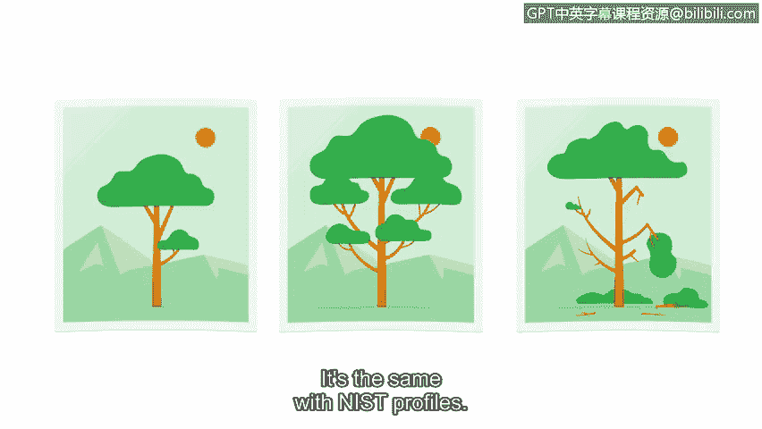

# 054：NIST网络安全框架

## 概述
在本节课中，我们将要学习网络安全合规性的概念，并重点介绍一个重要的合规性框架——NIST网络安全框架。我们将了解该框架的核心组成部分及其在保障信息安全中的作用。

---

拥有计划只是保护资产的一个环节。一旦计划开始执行，另一部分工作就是确保每个人都遵循安全规范，我们称之为合规性。

合规性是遵守内部标准和外部法规的过程。全球范围内，无论是小型公司还是大型组织，都将安全合规性置于其优先事项列表的首位。从宏观层面看，维护信任、声誉、安全以及数据的完整性，仅仅是关注合规性的部分原因。

罚款、处罚和诉讼则是其他原因。这对于受高度监管行业（如医疗保健、能源和金融）的公司尤其如此。不遵守法规可能导致持久的经济和声誉影响，从而严重损害业务。

法规是由政府或其他权威机构制定的规则，用以控制某些行为方式。与政策类似，法规的存在是为了保护人们及其信息，但其适用范围更广。

由于世界各地存在众多法规，合规性可能是一个复杂的过程。为了便于理解，我们将聚焦于一个安全合规性框架——基于美国的NIST网络安全框架。在本课程早期，你已了解到美国国家标准与技术研究院（NIST）。NIST的主要职责之一是公开为企业提供一系列反映关键安全相关法规的框架和安全标准。

NIST网络安全框架是一个自愿性框架，包含用于管理网络安全风险的标准、指南和最佳实践。通常简称为CSF，该框架旨在帮助企业保护其最重要的资产之一——信息。

CSF框架由三个主要组成部分构成：核心、层级和配置文件。让我们一起来探索每一个部分，以更好地理解NIST CSF是如何被使用的。

### 核心
核心本质上是安全计划职能或职责的简化版本。CSF核心确定了五个广泛的职能：识别、保护、检测、响应和恢复。你可以将这些核心类别视为一份安全检查清单。

### 层级
在核心之后，我们要讨论的下一个NIST组件是其层级。这些层级为安全团队提供了一种衡量核心五个职能绩效的方法。

层级范围从第1级到第4级。第1级（被动级）表示某项职能仅达到最低标准。第4级（自适应级）则表示某项职能的执行达到了行业领先标准。你可能已经注意到，CSF层级并非简单的“是”或“否”命题，而是存在一个数值范围。这是因为层级的设计目的是向组织展示其安全计划中哪些部分有效，哪些部分无效。

### 配置文件
最后，配置文件是CSF的最终组成部分。它们提供了对安全计划当前状态的洞察。

理解配置文件的一种方式是将其视为捕捉特定时刻的照片。比较同一主体在不同时间拍摄的照片可以提供有用的见解。例如，没有这些照片，你可能不会注意到这棵树发生了怎样的变化。配置文件也是如此。

良好的安全实践不仅仅是为了避免罚款和攻击。它更表明了你关心人们及其信息。

在我们继续之前，让我们再次回顾一下课程的职能，看看我们已经学习了什么，以及接下来将去向何方。

---

第一个职能是“识别”。我们之前关于资产管理和风险评估的讨论就与此职能相关。

接下来，我们将重点聚焦于第二个职能——“保护”职能的许多类别。我们那里见。

## 总结
本节课中，我们一起学习了网络安全合规性的重要性，并深入了解了NIST网络安全框架。该框架通过其核心（识别、保护、检测、响应、恢复）、层级（1-4级）和配置文件三个核心组件，为组织管理网络安全风险提供了系统化的方法和衡量标准。理解并应用此框架，是构建有效安全计划、保护关键信息资产的关键一步。