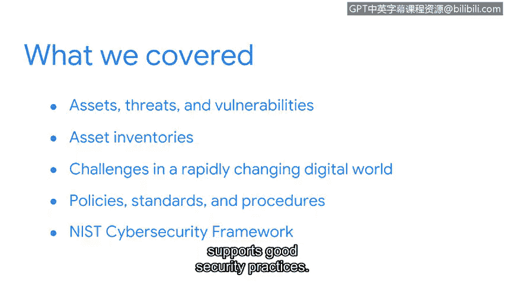

**谷歌网络安全专业证书第五课：《资产、威胁和漏洞》：P55：章节总结**

在本节课程中，我们将回顾并总结本周所学的关于组织风险管理、资产、威胁和漏洞的核心概念。

做得好。你完成了本节的学习。成为一名安全从业者需要承诺和学习意愿。

这项工作的很大一部分涉及紧跟最佳实践和新兴趋势。

回顾我自己进入安全领域的历程，我为你们持续的投入感到自豪。本周我们涵盖了大量内容。

现在是反思和回顾我们一起探讨的关键概念的好时机。

我们涵盖了组织风险管理的基石：**资产**、**威胁**和**漏洞**。我们还花时间演示了资产清单的重要性。如果你知道公司资产的位置以及负责人，保护它们就会容易得多。

之后，我们继续探讨了快速变化的数字世界中的挑战。在这个世界中保护数据的一部分是理解数据是处于**使用中**、**传输中**还是**静止状态**。

最后，在对**策略**、**标准**和**规程**的高层次探讨中，我们讨论了它们各自如何影响安全目标的实现。实现安全没有一刀切的方法。

在探索**NIST网络安全框架**时，你体会到了它如何支持良好的安全实践。

攻击者也在不断提升技能，寻找突破我们防御的新方法。请记住，安全形势始终在变化。如果你想成为一名优秀的安全从业者，总有更多东西需要学习。

接下来，我们将通过了解更多关于不同**系统**和**安全团队**用于保护组织资产的知识，来扩展我们的安全思维。我对此充满期待。

---

**总结**

本节课中，我们一起学习了组织风险管理的核心要素，包括资产识别、威胁与漏洞分析的重要性。我们还探讨了数据状态、安全策略框架（如NIST）以及安全从业者持续学习的必要性。这些知识为理解如何系统性地保护组织资产奠定了基础。