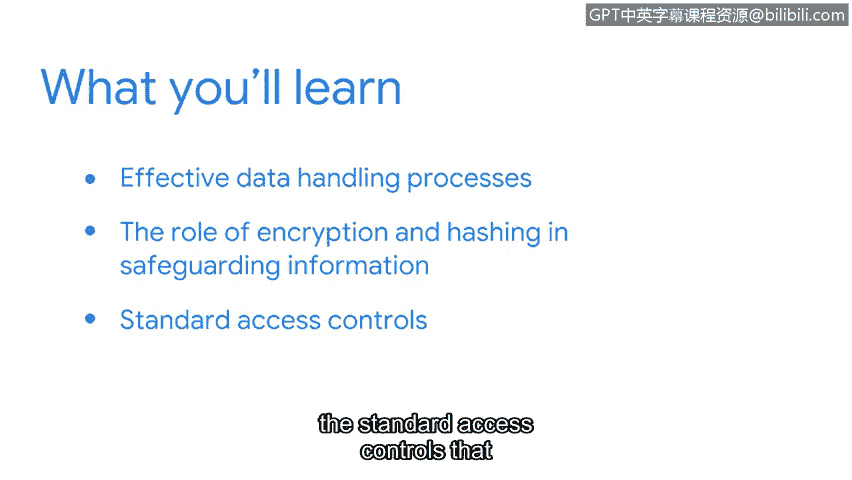

**网络安全基础：第五课：资产、威胁和漏洞 - P56：第2周导览**


在本节课中，我们将学习如何主动保护资产，重点探讨隐私、数据加密与哈希，以及标准的访问控制机制。这些是构建安全防线、预防问题发生的关键组成部分。

---

回顾上一节，我们主要聚焦于资产、风险和安全的核心概念，讨论了资产管理的重要性、数字世界带来的安全挑战与机遇，并初步探索了安全计划。基于这些扎实的基础，我们现在可以继续扩展我们的安全思维。

本节中，我们将介绍用于主动保护资产的安全控制措施。这里特意使用“主动”一词，因为正如你将发现的，这些控制措施是我们预先部署的保护机制，旨在问题发生之前就加以阻止。

我们将首先深入探讨隐私保护。以下是关于有效数据处理流程的核心内容，它们能确保信息安全：

*   **数据最小化**：仅收集和存储业务绝对必需的数据。
*   **数据保留政策**：明确规定不同类型数据的存储时长和处理方式。
*   **数据脱敏与匿名化**：在非必要使用敏感数据时，移除或替换其中的个人标识信息。

接下来，我们将探索加密和哈希在保护信息中的作用。加密是将可读数据（明文）转换为不可读格式（密文）的过程，只有拥有密钥才能解密。其核心公式可表示为：
`密文 = 加密算法(明文, 密钥)`
而哈希则是将任意长度的数据映射为固定长度的唯一字符串（哈希值），这个过程是单向的，无法逆向恢复原始数据。一个简单的代码示例表示其验证过程：
```python
# 假设存储的密码哈希值为 stored_hash
input_password = "用户输入"
hashed_input = hash_function(input_password)
if hashed_input == stored_hash:
    print("认证成功")
```

最后，你将学习公司用于授权和认证用户的标准访问控制模型。访问控制是确保只有授权用户才能访问特定资源的关键。以下是三种主要模型：

*   **自主访问控制**：资源所有者自主决定谁可以访问。
*   **强制访问控制**：基于系统设定的安全标签（如“机密”、“绝密”）进行访问决策。
*   **基于角色的访问控制**：根据用户在组织中的角色来分配权限。

---

本节课中，我们一起学习了如何通过主动的安全控制来保护资产。我们探讨了隐私保护的数据处理原则，理解了加密和哈希技术如何保障数据机密性与完整性，并认识了自主、强制和基于角色这三种核心的访问控制模型。这些知识构成了实施有效安全防护的基础框架。




好了，你准备好继续前进了吗？我已经准备好了。