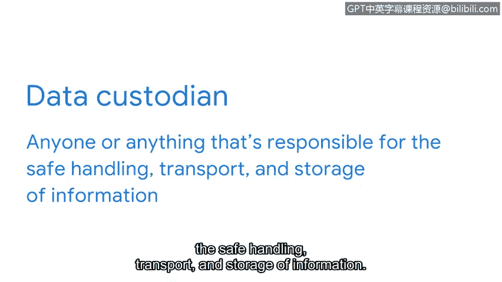

# 057：安全控制措施

## 概述
在本节课程中，我们将学习**安全控制措施**的概念、类型及其在保护信息隐私方面的重要作用。我们将了解技术、操作和管理三类控制措施，并探讨数据所有者与数据保管者之间的区别。

---

如今，信息同时存在于许多地方。因此，组织面临着巨大压力，需要实施有效的安全控制措施，以保护每个人的信息免遭窃取或泄露。

**安全控制措施**是为降低特定安全风险而设计的防护措施。它们包含一系列广泛的工具，用于在事件发生前、发生期间和发生后保护资产。安全控制措施可分为三种类型：**技术型**、**操作型**和**管理型**。

上一节我们介绍了安全控制的基本概念，本节中我们来看看它的具体类型。

以下是三种主要的安全控制类型：
*   **技术控制**：包含用于保护资产的多种技术。例如**加密**和**身份验证系统**。
*   **操作控制**：涉及日常安全环境的维护。通常由人员执行，例如**意识培训**和**事件响应**。
*   **管理控制**：围绕其他两类控制如何降低风险展开。管理控制的例子包括**政策**、**标准**和**程序**。

通常，组织的安全政策会概述实现其目标所需的控制措施。在这些决策中，**信息隐私**扮演着关键角色。

**信息隐私**是指防止对数据的未授权访问和分发。信息隐私关乎选择权。个人和组织都应有权决定何时、如何以及在何种程度上分享其私人信息。

安全控制是用于规范信息隐私的技术。例如，假设你使用一个旅行应用预订航班。你可能会浏览航班列表，找到一个价格合适的航班来预订座位。为了支付，你需要输入一些个人信息，如姓名、电子邮件和信用卡号。

交易成功后，你就预订了航班。现在，你有理由期望航空公司在完成预订时访问你注册时输入的这些信息。

然而，公司里的每个人都应该有权访问你的信息吗？营销部门的员工不需要访问你的信用卡信息。与客服人员分享该信息是合理的，但他们应仅在协助你处理预订时需要访问它。

为了维护隐私，安全控制旨在根据用户和具体情况限制访问。这被称为**最小权限原则**。设计安全控制时应牢记最小权限原则。当遵循此原则时，它们依赖于区分**数据所有者**和**数据保管者**。

*   **数据所有者**：是决定谁可以访问、添加、使用或销毁其信息的人。这个概念非常直接，除非存在多个所有者的情况。例如，一个组织的知识产权可以有多个数据所有者。
*   **数据保管者**：是负责信息的安全处理、传输和存储的任何个人或事物。

你是否注意到我提到了“事物”？这是因为除了人之外，组织及其系统也是人们信息的保管者。

在实施安全控制时，除了这些还有其他考虑因素。请记住，数据是一种资产，就像任何其他资产一样，信息隐私需要适当的分类和处理。随着本节的深入，我们将继续探索实现这一目标的其他安全控制措施。

---

## 总结
本节课中我们一起学习了安全控制措施的核心概念。我们了解到安全控制分为技术、操作和管理三类，是保护信息资产的关键。同时，我们明确了信息隐私的重要性，并引入了**最小权限原则**，以及**数据所有者**与**数据保管者**的角色区别，这些都是构建有效安全防护体系的基础。