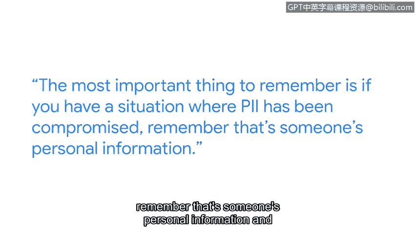

# 058：保护个人身份信息的重要性

在本节课程中，我们将跟随谷歌安全工程副总裁Heather，学习个人身份信息的重要性及其核心保护原则。我们将了解PII的分类、面临的挑战以及如何通过具体措施来保护它。

---

上一节我们介绍了网络安全的基本概念，本节中我们来看看个人身份信息这一具体资产。

PII无处不在。它是我们所有人持续在线工作的基本组成部分。

如果你正在使用在线资源，你可能正在某个地方提供你的PII。

你的部分PII是许多人知道的，例如你的姓名。

此外，还存在你不希望很多人知道的敏感数据。

例如你的银行账号或你的私人医疗健康信息。

因此我们做出这些区分。通常是因为这类信息需要以不同的方式处理。

我们现在所做的一切，从上学、投票到车辆注册，都发生在线上。正因如此，在我们的所有系统中默认内置安全保障变得至关重要。

以下是保护PII的一些核心技巧。

首先，当数据静态存储时，你应始终尽可能地加密数据。这可以通过以下方式实现：
*   使用强加密算法（如AES-256）对数据库中的字段进行加密。
*   对存储设备（如硬盘）进行全盘加密。

其次，当数据在互联网上传输时，我们始终希望使用TLS或SSL对其进行加密。这通常体现为网站使用**HTTPS**协议。

第三，在你的公司内部，你应该非常清楚地考虑谁有权访问该数据。如果数据非常敏感，那么几乎不应该让任何人访问。

在极少数情况下，如果有人确实需要访问该数据，则应该记录该次访问。记录内容包括谁访问了它以及访问的理由。

并且你应该建立一个程序来审查该数据的审计记录。

需要记住的最重要的一点是，如果你遇到PII遭到泄露的情况，请记住那是某个人的个人信息。你的应对措施需要基于这一现实。

用户需要能够信任基础设施、系统、网站和设备。他们需要能够信任他们正在获得的体验。对我来说，这就是使命：帮助每天保护数十亿人的在线安全。

---

本节课中我们一起学习了个人身份信息的定义、分类及其在数字时代的重要性。我们明确了保护PII的核心原则：对静态和传输中的数据进行加密，以及实施严格的访问控制和审计。最后，我们认识到保护PII不仅是技术问题，更关乎对人的尊重与信任，这是网络安全工作的根本使命。