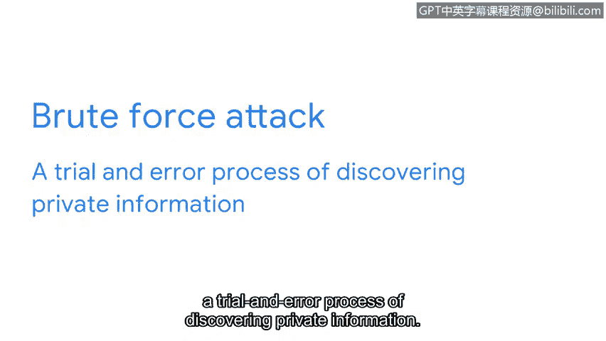

# 060：密码学基础

在本节课程中，我们将学习密码学的基础知识。密码学是保护在线信息隐私的核心技术。我们将了解信息如何被加密和解密，并探讨一个古老而简单的加密方法——凯撒密码，以及它的局限性。

互联网是一个开放的公网系统，有大量数据在其中流动。尽管我们都在线发送和存储信息，但有些信息我们选择在安全领域保持私密。这类数据被称为个人可识别信息。

个人可识别信息，简称PII，是指任何可用于推断个人身份的信息。这可以包括某人的姓名、医疗和财务信息、照片、电子邮件或指纹。在线维护PII的隐私很困难，需要正确的安全控制措施来实现。

用于在线保护信息的主要安全控制措施之一是密码学。密码学是将信息转换为非目标读者无法理解的形式的过程。

任何类型的数据都通过一个两步过程来保密：**加密**以隐藏信息，**解密**以恢复信息。想象一下给朋友发送电子邮件的过程。

该过程从获取原始且可读形式的数据开始，这种形式称为**明文**。**加密**获取该信息并将其打乱成不可读的形式，称为**密文**。

然后我们使用**解密**将密文恢复为明文形式，使其再次可读。隐藏和恢复私人信息的做法由来已久，远在计算机出现之前。

最早的密码学方法之一是凯撒密码。该方法以罗马将军尤利乌斯·凯撒的名字命名，他在公元前1世纪末统治罗马帝国。他用它来保持他与军事将领之间消息的私密性。

凯撒密码是一种相当简单的算法，其工作原理是将罗马字母表中的字母向前移动固定的位数。😊，**算法**是一套解决问题的规则。具体在密码学中，**密码**是一种加密信息的算法。

例如，使用移位数为3的凯撒密码编码的消息会将A编码为D，B编码为E，C编码为F，依此类推。在这个例子中，你可以给朋友发送一条消息“HELLO”，使用移位3，它会变成“KHOOR”。

现在，你可能想知道，如何知道凯撒密码加密消息所使用的移位量。答案是，你需要**密钥**。**密码学密钥**是一种解密密文的机制。在我们的例子中，密钥会告诉你我的消息是通过移位3加密的。有了这个信息，你就可以解锁隐藏的消息。每种加密形式都依赖于密码和密钥来确保信息转换的安全。

由于几个主要缺陷，凯撒密码在今天并未被广泛使用。一个缺陷与密码本身有关，另一个则与密钥有关。

这种特定的密码完全依赖于罗马字母表的字符来隐藏信息。例如，考虑一条使用仅包含26个字符的英文字母表编写的消息。即使没有密钥，通过26种不同的方式移位字母来破解用凯撒密码保护的消息也相当简单。

在信息安全中，这种策略被称为**暴力攻击**，即通过试错来发现私人信息的过程。

凯撒密码的另一个主要缺陷是它依赖于单一密钥。如果该密钥丢失或被盗，则无法阻止他人访问私人信息。妥善管理密码学密钥是安全的重要组成部分。首先，重要的是确保这些密钥不存储在公共场所，并且要与它们将要解密的信息分开共享。

凯撒密码只是用于保护人们隐私的众多算法之一。由于其局限性，我们依赖更复杂的算法来在线保护信息。

在下一节中，我们将重点探索现代算法如何工作以保持信息的私密性。

---

本节课中，我们一起学习了密码学的基本概念。我们了解到密码学通过加密和解密过程保护个人可识别信息的隐私。我们以凯撒密码为例，理解了算法和密钥在加密中的作用，同时也认识到简单加密方法在密钥管理和算法强度方面的局限性，这为理解现代更复杂的加密技术奠定了基础。