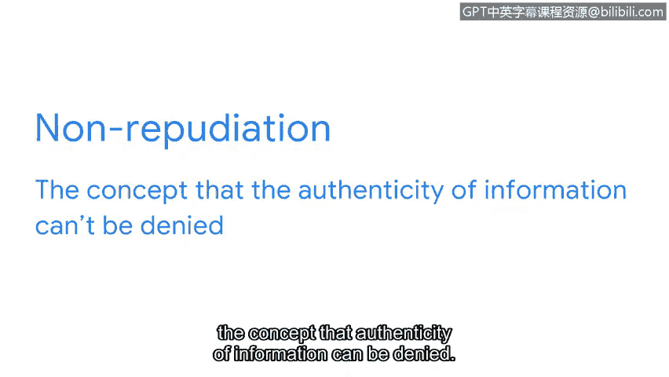
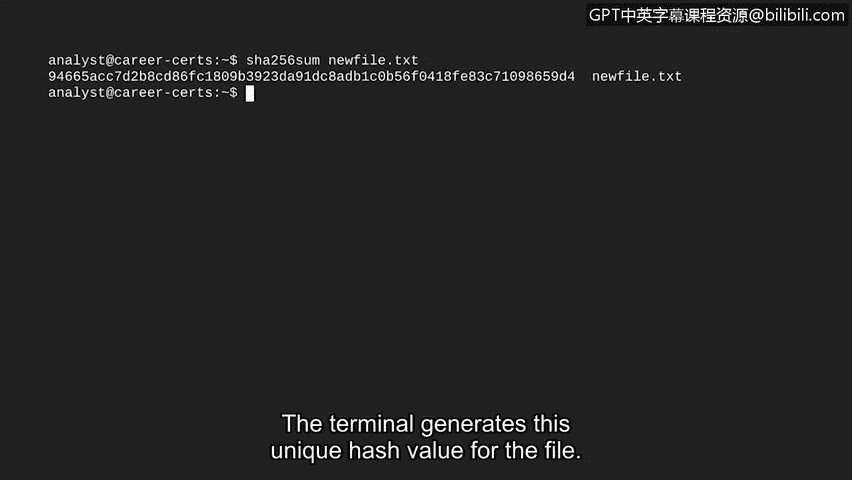

# 062：不可否认性与哈希函数

## 概述
在本节课程中，我们将学习一种重要的安全控制措施——哈希函数。我们将了解它如何工作，以及安全分析师如何利用它来验证数据的完整性，并防止“否认”行为，从而保护系统和数据免受威胁。

---

## 哈希函数简介
上一节我们探讨了对称和非对称加密，它们都涉及密钥的生成与共享。然而，加密密钥本身存在丢失或被盗的风险，可能导致敏感信息泄露。本节中，我们来看看另一种安全控制，它有助于解决这个弱点。

**哈希函数**是一种能生成无法解密的代码的算法。
与对称和非对称算法不同，哈希函数是单向过程，不生成解密密钥。
相反，这些算法会生成一个唯一的标识符，称为**哈希值**或**摘要**。

## 哈希函数的工作原理
以下是其工作原理的一个示例。想象一家公司有一个供员工使用的内部应用程序，存储在共享驱动器中。
该程序经过哈希函数处理后，会获得其哈希值。例如，我们使用MD5哈希函数生成了这个相对较短的哈希值。通常，更安全的标准哈希函数会产生更长的哈希值。

接下来，假设攻击者用一个执行恶意操作的修改版程序替换了原程序。
这个恶意程序可能看起来和原程序一样工作。但是，只要有一行代码与原程序不同，它就会产生一个不同的哈希值。
通过比较哈希值，我们可以验证这两个程序是不同的。攻击者经常使用这类伎俩，因为它们很容易被忽视。幸运的是，哈希值能帮助我们识别此类安全事件。

## 哈希的主要用途：确保数据完整性
在安全领域，哈希主要用于确定文件和应用程序的完整性。
**数据完整性**关系到信息的准确性和一致性。
这被称为**不可否认性**，即信息的真实性无法被否认。
哈希函数是实现可验证数据完整性的重要安全控制，分析师们经常使用它们。

以下是分析师使用哈希的一种方式：
分析师通过查找文件或应用程序的哈希值，并将其与已知的恶意文件进行比较。

例如，我们可以使用Linux命令行来生成计算机上任何文件的哈希值。
我们只需启动shell，然后输入想要使用的哈希算法名称。这里，我们使用一个常见的算法——SHA-256。
接下来，我们需要输入想要进行哈希处理的任何文件的文件名。

让我们对 `newfile.txt` 的内容进行哈希处理。现在，按下回车键。
终端会为该文件生成这个唯一的哈希值。

## 实践应用：与威胁情报对比
这些工具生成的哈希值可以与已知的在线病毒哈希值进行比较。
其中一个这样的数据库是 **VirusTotal**。这是安全从业者中一个流行的工具，可用于分析可疑文件、域名、IP地址和URL。

正如我们所探讨的，即使输入发生最微小的变化，也会导致完全不同的哈希值。
哈希函数被特意设计成这样，以协助处理不可否认性问题。
它们为计算机提供了一种快速简便的方法来比较输入和输出值，并验证数据完整性。

---

## 总结
本节课中，我们一起学习了哈希函数。我们了解到哈希是一种单向算法，能生成唯一的哈希值，用于验证数据的完整性，是实现“不可否认性”的关键安全控制。通过比较哈希值，安全分析师能够有效识别被篡改的文件和恶意软件，从而保护组织资产。