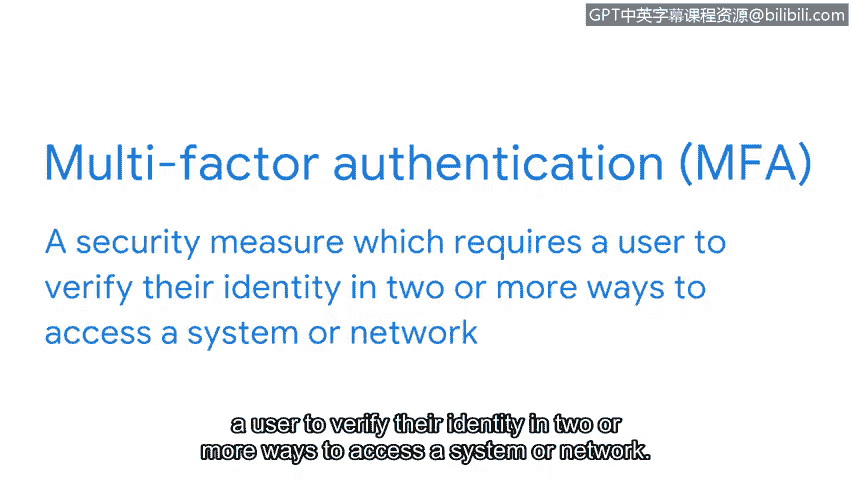

# 063：访问控制与认证系统 🔐

在本节课程中，我们将学习访问控制的基础知识，特别是认证系统。我们将了解认证如何作为保护数据安全的第一道防线，以及其背后的核心概念和实现方式。

保护数据是安全控制的基本功能。在确保信息安全方面，哈希和加密是强大但有限的工具。管理谁或什么可以访问信息同样是保障信息安全的关键。

接下来我们将探讨的一系列控制措施是访问控制，即管理信息访问、授权和问责的安全控制。当执行良好时，访问控制能维护数据的**机密性、完整性和可用性**。它们还能让用户快速获取所需信息。

这些系统通常被分解为三个独立但相关的功能，即**认证、授权和记账框架**。每个控制都有其自身的协议和系统来实现其功能。

在本视频中，我们先来熟悉列表中的第一个基础概念：认证。

## 认证系统：你是谁？ 🔑

认证系统是一种访问控制，其目的非常基础。它向任何试图访问信息的对象提出一个简单的问题：**你是谁？**

组织根据其安全策略的目标，以不同的方式收集这个问题的答案。有些方式比其他方式更彻底，但总的来说，对这个问题的回答可以基于以下三个认证因素：

以下是三种主要的认证因素：

1.  **知识**：基于知识的认证指的是用户知道的东西，例如密码或之前提供的安全问题的答案。
2.  **所有权**：指的是用户拥有的东西。一种常用的基于所有权的认证类型是**一次性密码**。你可能在某个时候体验过这种认证。它是一个随机数字序列，应用程序或网站会通过短信或电子邮件发送给你，并要求你提供。
3.  **特征**：基于此因素的认证指的是用户本身具有的特征。例如，智能手机上的指纹扫描就是一种生物特征认证。虽然并非无处不在，但这种认证形式正变得越来越普遍，因为与模仿密码相比，犯罪分子要模仿指纹或面部扫描要困难得多。

认证过程中提供的信息需要与存档的信息相匹配，这些访问控制才能生效。当凭证不匹配时，认证失败，访问被拒绝；当匹配时，访问被授予。

错误地拒绝访问会让任何人感到沮丧。为了使访问系统更加方便，如今许多组织依赖**单点登录**。

## 单点登录与多因素认证 🔄

单点登录是一种将多个不同登录整合为一的技术。你能想象每次与朋友见面都要重新自我介绍吗？这正是单点登录所解决的问题。它不需要用户反复进行身份验证，而是**一次性建立其身份**，允许他们更快地获得对公司资源的访问权限。

虽然单点登录系统在加速认证过程方面很有帮助，但单独使用时，它会带来一个显著的漏洞。错误地拒绝授权用户的访问令人沮丧，但更糟糕的是错误地向错误的用户授予访问权限。单点登录技术很棒，但如果它只依赖单一的认证因素，则存在风险。

添加更多的认证因素可以加强这些系统。**多因素认证**是一种安全措施，要求用户通过两种或更多方式来验证其身份，以访问系统或网络。

`MFA = 知识因素 + 所有权因素 + (可选) 特征因素`

多因素认证结合了两个或多个独立的凭证，例如知识和所有权，来证明某人就是他们所声称的身份。单点登录和多因素认证经常结合使用，以增强认证系统的防御能力。当两者同时使用时，组织可以确保访问既方便又安全。

现在我们已经介绍了认证，我们准备探索框架的第二部分。接下来，我们将学习授权。

---

**本节课总结**：在本节课中，我们一起学习了访问控制的基础，重点探讨了认证系统。我们了解了认证的三个关键因素（知识、所有权、特征），认识了单点登录带来的便利性与潜在风险，并理解了多因素认证如何通过组合不同因素来显著提升安全性。认证是确保“你是谁”的第一步，为后续的授权控制奠定了基础。