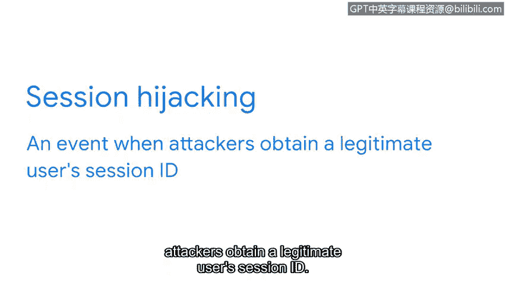

# 065：为什么我们需要审计用户活动

在本节中，我们将学习认证、授权和记账框架中的第三个核心功能——记账。我们将了解什么是访问日志、会话机制如何工作，以及为什么监控用户活动对于识别安全威胁至关重要。

你是否曾想过，你的雇主是否会记录你登录公司系统的时间和操作？如果他们实施了认证、授权和记账框架中的第三个也是最后一个功能——记账，那么他们确实会这样做。记账是指监控系统访问日志的实践。

这些日志包含了诸如谁访问了系统、何时访问以及使用了哪些资源等信息。安全分析师经常使用访问日志。其中包含的数据是识别趋势（例如失败的登录尝试）的有效方式，也用于发现已获得系统访问权限的黑客，以及检测数据泄露等安全事件。在调查安全事件时，分析访问日志通常是首要步骤。

那么，访问日志是如何编译所有这些有用信息的呢？让我们更仔细地研究一下。

## 会话与访问日志

上一节我们介绍了记账的概念，本节中我们来看看访问日志是如何记录用户活动的。每当用户访问一个系统时，他们都会启动一个所谓的“会话”。

一个**会话**是指与同一用户相关联的一系列网络、HTTP或基本授权请求和响应，就像你访问一个网站时发生的那样。访问日志本质上是会话的记录，它捕获了用户进入系统到离开系统的整个过程。

会话开始时，会触发两个动作。第一个是创建**会话ID**。会话ID是一个唯一的令牌，用于在用户访问系统时识别用户及其设备。会话ID会一直附着在用户身上，直到他们关闭浏览器或会话超时。

会话开始时发生的第二个动作是服务器与用户设备之间交换**会话Cookie**。会话Cookie是网站用来验证会话并确定会话应持续多长时间的令牌。

当Cookie在你的计算机和服务器之间交换时，你的会话ID会被读取，以确定网站应向你显示哪些信息。Cookie使网络会话更安全、更高效。这种令牌交换意味着不会共享用户名和密码等敏感信息。

## 会话劫持的风险

会话Cookie可以防止攻击者获取敏感数据。然而，他们仍然可以利用被盗的Cookie造成其他损害。攻击者可以使用用户的会话令牌来冒充该用户。这种攻击被称为**会话劫持**。

会话劫持是指攻击者获取合法用户会话ID的事件。在此类攻击中，网络犯罪分子会冒充用户，造成各种危害。例如，可以窃取更多私人数据。如果攻击者从被盗的Cookie中获得了单个会话凭证，他们甚至可能获得对其他看似安全系统的访问权限。

## 审计的重要性

这正是记账和监控会话日志如此重要的原因之一。访问日志上的异常活动可能表明信息被不当访问或窃取。归根结底，记账是我们获取宝贵洞察、使信息更安全的方式。

本节课中，我们一起学习了记账功能如何通过记录和分析访问日志来监控用户活动。我们了解了会话、会话ID和Cookie的工作原理，以及会话劫持带来的风险。审计用户活动对于及时发现安全威胁、保护系统免受攻击至关重要。