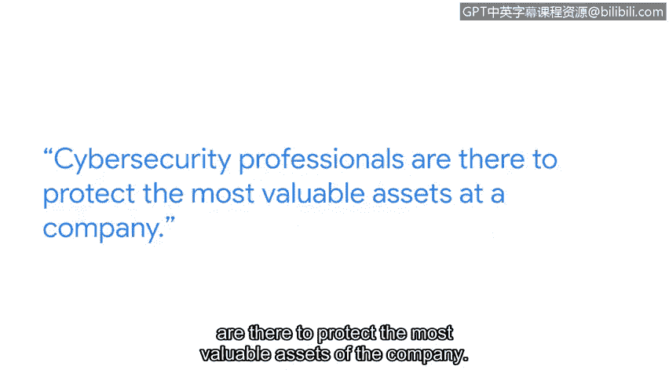

# 066：保护资产的意义

## 概述
在本节课程中，我们将通过谷歌检测与响应团队专家蒂姆的分享，了解网络安全工作的核心价值与职业意义。我们将探讨网络安全专家如何保护公司最宝贵的资产，以及这份职业带来的满足感与广阔前景。

---

我叫蒂姆，在谷歌的检测与响应团队工作。

你可以把我们想象成谷歌的烟雾探测器和消防部门。

我们的工作是检测可能影响谷歌及其用户的有害活动。

这里的风险非常高。想象一下你在谷歌上拥有的东西，无论是文档、照片、你的财务信息，还是你的一些秘密，那些你不想让任何人知道的事情。这些正是我们要保护的东西。

网络安全专家的职责就是保护公司最有价值的资产。你将负责保护它们。你所做的工作与公司认为最重要、最有价值、最需要保护的东西直接相连，我认为这为从业者提供了巨大的目标感、动力，并为一份非常令人满意的职业生涯奠定了坚实的基础。

网络安全是一份回报丰厚的职业。它是一个在许多公司都至关重要的职能。

并且这是一个需求量很大的职业，市场上绝对缺乏有才华的劳动力。因此，从这个角度来看，如果你正在寻找一条通往可行、长期且有回报的职业道路，这无疑是一条非常直接的路径。

## 总结
本节课中，我们一起学习了网络安全工作的核心目标：保护组织最宝贵的数字资产。我们了解到，这份工作将个人职责与公司的核心价值直接相连，提供了强烈的目标感和职业满足感。同时，网络安全领域人才需求旺盛，为寻求长期稳定且有意义职业的初学者指明了一条清晰的发展道路。