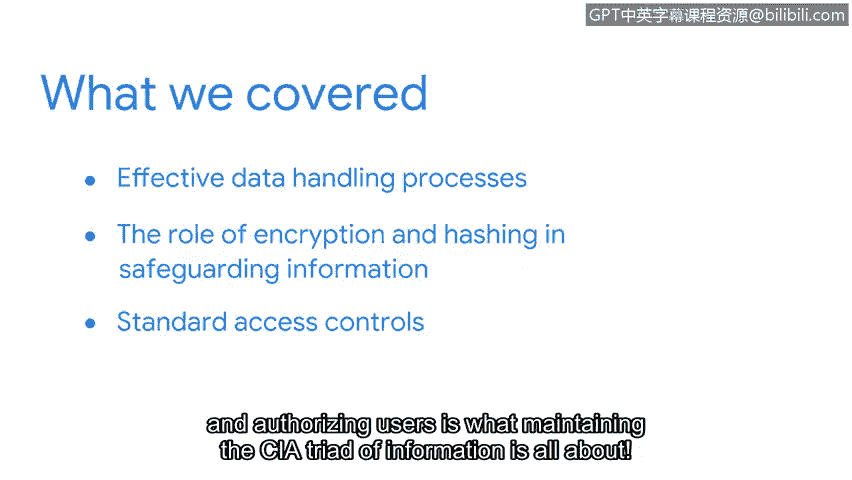

# 067：章节总结

在本节课程中，我们学习的核心主题是**保护资产**，这是网络安全的基础。资产保护在很大程度上与隐私权相关，每个人都应享有决定谁能访问自己信息的权利。我们将回顾本节探讨的几种有助于保护资产的安全控制措施。

## 🛡️ 资产保护与隐私权

上一节我们介绍了安全的核心目标，本节我们将重点放在实现这些目标的具体方法上，即保护组织与个人的关键资产。保护资产的一个主要方面是维护隐私。每个人都应享有决定谁能访问自己信息的权利。

通过学习，我们了解到有几种控制措施可以帮助保护资产安全。

## 🔐 最小权限原则与数据处理

我们首先探讨了基于**最小权限原则**的有效数据处理流程。该原则确保用户和系统仅拥有执行其任务所必需的最低级别访问权限。

## 🔑 加密与哈希的作用

随后，我们研究了加密和哈希在保护信息中的作用。加密是将数据转换为密文的过程，以防止未授权访问。

我们探讨了**对称加密**和**非对称加密**的工作原理。
*   **对称加密**使用同一个密钥进行加密和解密，其过程可以表示为：`密文 = 加密(明文， 密钥)`， `明文 = 解密(密文， 密钥)`。
*   **非对称加密**使用一对公钥和私钥，其过程可以表示为：`密文 = 加密(明文， 接收方公钥)`， `明文 = 解密(密文， 接收方私钥)`。

同时，我们也了解了哈希如何进一步保护数据免受损害。哈希是将数据转换为固定长度字符串（哈希值）的单向过程，常用于验证数据完整性，其过程可以表示为：`哈希值 = 哈希函数(数据)`。

## 👥 标准访问控制与AAA框架

接着，我们将注意力转向标准访问控制。正确地验证用户身份并授予相应权限，是维护信息**CIA三要素**（机密性、完整性、可用性）的核心。

我们使用**AAA安全框架**（认证、授权、计费）详细了解了身份与访问管理系统，以及用于验证用户是否为其所声称身份的访问控制措施。

## 🎉 课程进展与前瞻

完成得很棒！你已经成功完成了课程前半部分的学习，目前取得了巨大进展。希望你继续保持。请记住，你的背景和经验在这个领域非常有价值。结合我们目前所涵盖的概念，你将成为任何安全团队中有价值的贡献者。

到目前为止，我们一直在探索安全的防御层面。但安全不仅仅是提前规划和等待事件发生。

在接下来的学习旅程中，我们将通过从攻击者的角度更主动地审视安全，继续培养安全思维模式。我们下一部分再见。

---

**本节总结**

在本节课中，我们一起学习了资产保护的核心主题。我们回顾了基于最小权限原则的数据处理、加密与哈希技术的工作原理，以及通过AAA框架实施的访问控制。这些措施共同构成了保护信息资产、维护隐私和安全的基础。同时，我们也为课程下一阶段从攻击者视角进行主动安全分析做好了准备。